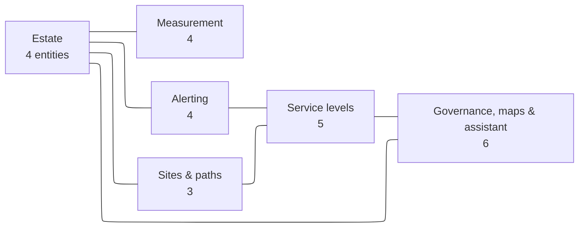
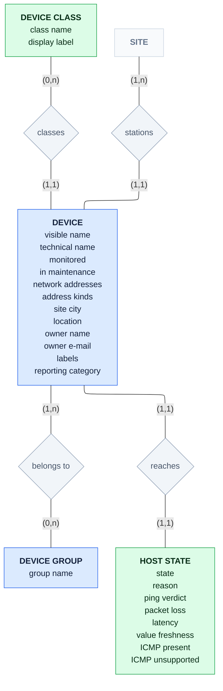
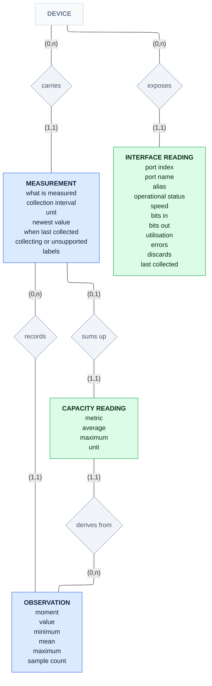
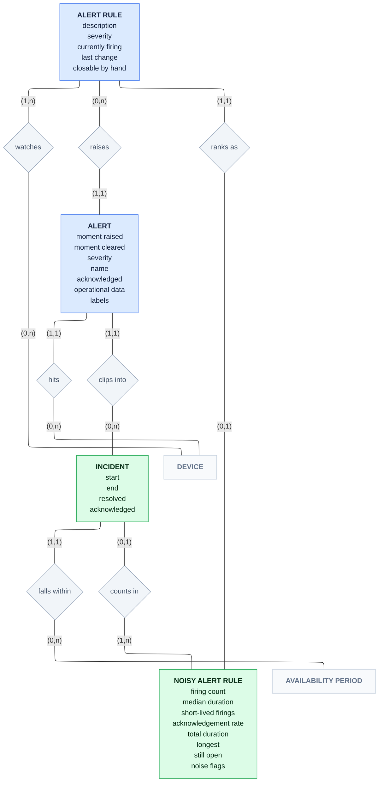
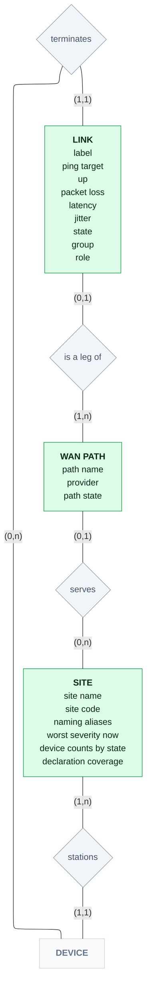
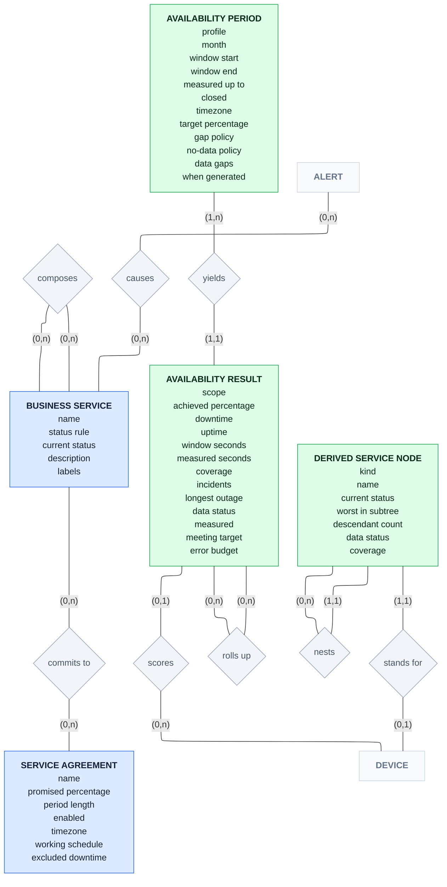
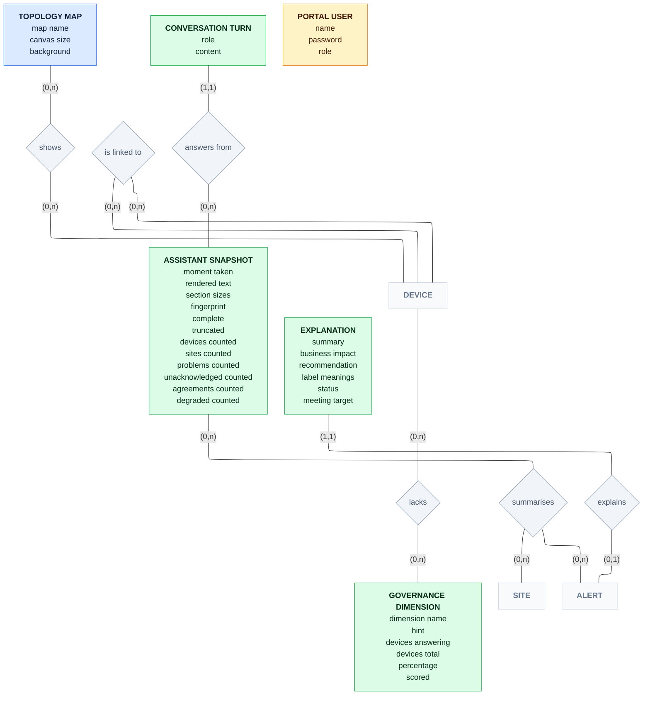

# Conceptual model: HCML Monitoring Portal

The top of three levels. This one answers *what does the business talk about*: 26 entities and 33
associations, with no keys, no foreign keys and no types, because a conceptual model has none of those.
The level below it, [`../vanilla/ERD-Domains.md`](../vanilla/ERD-Domains.md), answers *what does the portal
read and derive*; the one below that, [`../database/ERD-Database.md`](../database/ERD-Database.md), answers
*what does MySQL store*. The index of all three is in [`../../../erd.md`](../../../erd.md).

The single diagram is [`ERD-Conceptual.mmd`](ERD-Conceptual.mmd), pre-rendered as [`ERD-Conceptual.pdf`](ERD-Conceptual.pdf) (vector, the one to read) and [`ERD-Conceptual.png`](ERD-Conceptual.png).

**Where it comes from.** Not from a schema: a conceptual entity is a judgement, not a generated artefact.
Each one here was read out of the code and the two lower models together, and every cardinality is either
checked against a foreign key in the physical model or, where there is no table at all, cited to the
function that computes it. The 19 associations with a schema counterpart are listed with it; the 7 that have
none are marked *conceptual only*.

**Why it merges things the other models separate.** Nobody at HCML says "a host interface", they say "the
switch's management address". So `HOST`, `HOST_INTERFACE`, `HOST_INVENTORY` and `HOST_TAG`, four entities in
the logical model over six tables in the physical one, are one **Device** here. Six logical shapes that all
answer "what did this achieve over this period": `SliHost`, `SliGroup`, `SliPath`, `HostAvailability`,
`SlaSli`, `ServiceSla` are one **Availability Result**. That merging is the whole value of this level; if
an entity here maps one-to-one onto a logical one, it is earning nothing.

**Reading it:** a **rectangle** is an entity and the properties the business would name · a **diamond** is a
named association, read in the verb's direction · **(min,max)** on a leg is how many times one occurrence of
that entity takes part, so `(1,1)` beside Device on *stations* means every device is at exactly one site ·
**blue** is observed, Zabbix holds it · **green** is derived, the portal computes it and nothing stores it ·
**amber** is local to the portal · **grey** diamonds are the associations themselves.

**The approximation, stated plainly.** Mermaid has no MCD diagram type, so this is a flowchart wearing
Merise clothes. The diamonds are decorative: nothing validates that one has exactly two legs or that
cardinalities come in pairs. Identifying relationships, generalisation and n-ary associations cannot be
drawn at all. Map links (R30) are the visible casualty: Merise cannot associate an association, so a link
between two map elements is drawn device-to-device with the map scope stated in words instead.

> This document is shared by both portals, byte for byte, as is the diagram it describes. They run one
> source tree; only `.env` and the published port differ.

To regenerate the renders after editing the `.mmd`:

```bash
npx @mermaid-js/mermaid-cli -i ERD-Conceptual.mmd -o ERD-Conceptual.pdf -w 2600 -b white --pdfFit
npx @mermaid-js/mermaid-cli -i ERD-Conceptual.mmd -o ERD-Conceptual.png -w 2600 -s 2 -b white
```

`LR`, not `TB`. A Merise graph puts an extra node on every edge, so its longest path is about double the
logical model's: `TB` came out 3712 × 16590, a 1:4.5 tower. `LR` is 5168 × 1348. Even so the single canvas
is a **reference sheet, not a reading diagram**. Read the six domain views below instead.

---

## Domain map

Six domains, not the logical model's nine: once several logical entities merge into one conceptual entity,
Governance, Maps and Admin are each too thin to earn a frame of their own.



Every domain touches **Estate**, because Device is the hub: nine of the 33 associations have a Device leg.
That is also why the single canvas is a hairball and these six views are not.

| Conceptual domain | Logical domains it covers ([`../vanilla/ERD-Domains.md`](../vanilla/ERD-Domains.md)) |
|---|---|
| Estate | Hosts & Inventory |
| Measurement | Metrics & Items |
| Alerting | Events & Incidents |
| Sites & paths | Sites & Links |
| Service levels | Services & SLA |
| Governance, maps & assistant | Governance scorecard, Maps, AI layer, Admin & system |

---

## Estate



**Host State is an entity, not a property of Device.** The portal answers "is it down?" ping first, because
on 17 September 2026 sixteen of HCML's twenty-three devices marked *unavailable* by Zabbix answered ping,
and forty-three devices had no interface at all. The verdict is five states and eight reasons with a
documented precedence (`server/src/reachability.ts:19,22,158-181`), which is more than an attribute can
carry. **No existing ERD covers it.**

***stations* carries the site signal, and that is why it is an association and not a foreign key.** A
device's site is resolved from four signals in order: its `site` tag, then **its own name** parsed against
HCML's `<site>.<class>.<seq>` convention, then inventory `site_city`/`location`, then its host group
(`server/src/routes/sites.ts:25,84-106`). Which signal answered belongs to neither Device nor Site; it is a
property of *this device being placed at this site*, and it is the only reason the coverage counters can
exist. It also decides governance: the scorecard counts a site resolved from the group as a **failure** to
declare one, so R2's signal is what makes R28 true or false.

---

## Measurement



**Observation is one entity at two granularities.** The physical model has seven tables: five `history_*`
plus `trends` and `trends_uint`, chosen by value type and age. Conceptually they are one thing: a recorded
sample. The hourly form simply carries minimum, mean, maximum and a sample count where the raw form carries
a value.

**This is the one place the physical model deliberately has no foreign key.** `history.itemid` references
nothing; a key there would cost an index check on every inserted value, and deleting one measurement would
try to cascade millions of row deletes in a single transaction. The relationship is real, the constraint is
absent on purpose. See the *cascade* legend in
[`../database/ERD-Database.md`](../database/ERD-Database.md).

***derives from* carries the evidence source**: trends, raw history on an instance too young to have
trends, or none at all. The same capacity figure means different things depending on which answered, so the
source belongs to the association (`server/src/routes/analytics.ts:560-572`).

**Interface Reading is absent from every existing ERD** (`server/src/routes/net.ts:9-16,41-56`).

---

## Alerting



***watches* is many-to-many, and it is the model's most-mislaid truth.** An alert rule has no device column
anywhere: the path runs rule → function → measurement → device, so one expression can watch several devices
at once. The portal collapses that to the first device in five places. The M:N is drawn because it is true;
the collapse is a portal decision, and a lossy one.

**Incident is a reified association, not a thing.** It is one alert seen inside one reporting window, with
its ends clipped to that window, which is exactly *Alert × Availability Period*. It is drawn as an entity
because it carries its own clipped start and end, and because everything downstream (availability, noise)
counts incidents rather than alerts.

---

## Sites & paths



**Every entity in this domain is green.** Zabbix has no site object in any form, no link and no path; this
whole domain is the portal's arithmetic and grouping, and it is the point of the project.

***stations* is a total function** (the resolver always returns, falling back to *Unassigned*) so sites
partition the estate and the device counts always add up.

***is a leg of* starts at (0,1), and that matters.** A link with no group label belongs to no path, which is
why the links list and the paths' legs overlap rather than partition. A path is **down only when every leg
is down**.

---

## Service levels



**Two identically-shaped associations, one crucial difference.** *composes* on Business Service is
many-to-many: a shared SD-WAN core legitimately sits under both Offshore and Onshore, so services form a
**DAG**. *nests* on Derived Service Node is `(1,1)` on the child side: the tree the portal synthesises is a
**strict tree**, built top-down estate → business or site → class → WAN path → device. Confusing the two is
how a traversal starts double-counting or loops, which is why the real one carries a cycle guard and a depth
limit. They are set side by side deliberately.

***commits to* has no key anywhere in the system.** Nothing joins a service to an agreement: the labels are
matched when the query runs, and every figure is computed on the fly. That is also why nothing stores an
achieved percentage.

**Availability Period's two profiles are one property, not two entities.** `hcml-report` counts only high
ping loss, treats gaps as up and answers 100 % where there is no data; `availability` is strict: ICMP
unavailability or high loss, gaps excluded, no figure at all below half coverage. They change the
arithmetic, not the subject, so they are a property of the period. **The whole SLI engine is absent from
every existing ERD** (`server/src/sli/engine.ts`, `server/src/sli/tree.ts`).

---

## Governance, maps & assistant



***lacks* is a pure association, which is why the gap list is not an entity.** A device lacking a dimension
*is* the relationship; there is nothing else to say about it.

***summarises* is where the assistant's limits become part of the model.** The snapshot is the whole of what
the assistant knows: it has no tools and cannot query anything, so a device absent from the snapshot does
not exist as far as any answer is concerned. The association therefore carries each section's character
budget and whether that section was cut: the snapshot is capped at 5,500 characters overall, with a budget
per section and at most 20 problems, and the page says *partial view* when a cap fired
(`server/src/chat.ts:81-93`). A snapshot is frozen for five minutes and so answers several turns, and a
host-state change must hold for a minute before it forces a rebuild, which is why *answers from* is
`(0,n)` on the snapshot leg.

**Portal User takes part in no association, deliberately.** It is parsed from an environment variable and
never leaves the portal; Zabbix has no idea it exists.

---

## Entities at a glance

`O` observed · `D` derived · `L` local. "Merges" names what this entity absorbs from
[`../vanilla/ERD-Domains.md`](../vanilla/ERD-Domains.md); an entity that merges nothing is earning nothing
at this level, and there are only four of those.

| Entity | | Merges, or where it comes from |
|---|---|---|
| Device | O | `ZBX_HOST` + `HOST_INTERFACE` + `HOST_INVENTORY` + `HOST_TAG` |
| Device Group | O | `ZBX_HOST_GROUP` |
| Device Class | D | `naming.ts`: eight classes, no logical equivalent |
| Host State | D | `reachability.ts`, `HostState` + `StateReason` + `Availability` + `IcmpReading`. **New** |
| Measurement | O | `ZBX_ITEM` + `ITEM_TAG` |
| Observation | O | `ZBX_HISTORY` + `ZBX_TREND`: one concept, two granularities |
| Interface Reading | D | `routes/net.ts`, `InterfaceRow` + `OperStatus`. **New** |
| Capacity Reading | D | `CAPACITY_ROW` |
| Alert Rule | O | `ZBX_TRIGGER` |
| Alert | O | `ZBX_EVENT` / `PROBLEM` + `PROBLEM_TAG` |
| Incident | D | `INCIDENT`: a reified Alert × Period |
| Noisy Alert Rule | D | `NOISY_TRIGGER` + `TOP_TRIGGER` |
| Site | D | `SITE` + `SITE_HOST` |
| Link | D | `LINK` |
| WAN Path | D | `LINK_PATH` + `SliPath`'s path half |
| Business Service | O | `ZBX_SERVICE` + `SERVICE_TAG` |
| Service Agreement | O | `ZBX_SLA` + its schedule and exclusions |
| Availability Period | D | `SliReport` + its basis. **New** |
| Availability Result | D | `SliHost` + `SliGroup` + `SliPath` + `HostAvailability` + `SlaSli` + `ServiceSla`: six shapes, one fact. **New** |
| Derived Service Node | D | `sli/tree.ts`. **New** |
| Governance Dimension | D | `DIMENSION` / `SCORECARD_DIMENSION`, exactly four |
| Topology Map | O | `ZBX_MAP` |
| Assistant Snapshot | D | `CHAT_SNAPSHOT` + the frozen text, sizes and fingerprint |
| Conversation Turn | D | `CHAT_TURN` |
| Explanation | D | `PROBLEM_EXPLANATION` + `TAG_EXPLAINED` + `SLA_EXPLANATION` |
| Portal User | L | `PORTAL_USER` |

### What is deliberately not an entity

The response envelopes, `SITES_RESPONSE`, `LINKS_RESPONSE`, `SERVICES_RESPONSE`, `AVAILABILITY_REPORT`,
`NOISE_REPORT`, `SCORECARD`, `CAPACITY_REPORT`, `AGING_REPORT` are transport, not concepts: they exist
because HTTP needs one object per response. `STATS` and `GROUP_PROBLEMS` are counters. `AGING_BUCKET` and
`TOP_TRIGGER` are presentations of Alert and Alert Rule. `SITE_HOST` is *stations* (R2), `HOST_GAP` is
*lacks* (R28), `GROUP_SCORE` is *lacks* counted per group, and `MAP_ELEMENT` is *shows* (R29): all
associations, none of them things. `MAP_SELEMENT` and `MAP_LINK` disappear for the same reason.

---

## Associations at a glance

Read each row as *left, (min,max), verb, (min,max), right*. **M:N** marks a genuine many-to-many;
**carries** marks a *relation porteuse*, an association with properties of its own. The last column cites
the physical model where a foreign key backs the cardinality, and the code where none does.

| | Left | | Verb | | Right | Evidence |
|---|---|---|---|---|---|---|
| R1 | Device | (1,n) | belongs to | (0,n) | Device Group | **M:N**: a link table with a key on both sides |
| R2 | Site | (1,n) | stations | (1,1) | Device | **carries** the signal · conceptual only, `routes/sites.ts:84-106` |
| R3 | Device Class | (0,n) | classes | (1,1) | Device | conceptual only, `naming.ts`, total, defaults to *other* |
| R4 | Device | (1,1) | reaches | (1,1) | Host State | conceptual only, `reachability.ts:158`, total, disabled devices included |
| R5 | Device | (0,n) | carries | (1,1) | Measurement | a NOT NULL foreign key |
| R6 | Measurement | (0,n) | records | (1,1) | Observation | **no foreign key on purpose**. See Measurement above |
| R7 | Device | (0,n) | exposes | (1,1) | Interface Reading | conceptual only, `routes/net.ts:59-65`, SNMP devices only |
| R8 | Measurement | (0,1) | sums up | (1,1) | Capacity Reading | keyed by measurement, three metrics only |
| R9 | Capacity Reading | (1,1) | derives from | (0,n) | Observation | **carries** the evidence source |
| R10 | Alert Rule | (1,n) | watches | (0,n) | Device | **M:N**, rule → function → measurement → device |
| R11 | Alert Rule | (0,n) | raises | (1,1) | Alert | no foreign key, total in the data |
| R12 | Alert | (1,1) | hits | (0,n) | Device | derived: stitched by a second query, a consequence of R10 + R11 |
| R13 | Alert | (1,1) | clips into | (0,n) | Incident | conceptual only: one incident per alert per window |
| R14 | Incident | (1,1) | falls within | (0,n) | Availability Period | completes R13 |
| R15 | Incident | (0,1) | counts in | (1,n) | Noisy Alert Rule | grouped by rule, above a minimum count |
| R16 | Alert Rule | (1,1) | ranks as | (0,1) | Noisy Alert Rule | only rules above the threshold are ranked |
| R17 | Device | (0,n) | terminates | (1,1) | Link | a link is one device–target pair |
| R18 | Link | (0,1) | is a leg of | (1,n) | WAN Path | **carries** the leg and the provider · conceptual only |
| R19 | WAN Path | (0,1) | serves | (0,n) | Site | nullable site on the path |
| R20 | Business Service | (0,n) | composes | (0,n) | Business Service | **M:N**, reflexive, a **DAG**: a link table |
| R21 | Business Service | (0,n) | commits to | (0,n) | Service Agreement | **M:N with no key at all**, matched by label at query time |
| R22 | Alert | (0,n) | causes | (0,n) | Business Service | **M:N**: a link table |
| R23 | Availability Period | (1,n) | yields | (1,1) | Availability Result | a period always yields at least the overall figure |
| R24 | Availability Result | (0,1) | scores | (0,n) | Device | (0,1) because group results score no single device |
| R25 | Availability Result | (0,n) | rolls up | (0,n) | Availability Result | **M:N**: one device figure feeds site, class and overall at once |
| R26 | Derived Service Node | (0,n) | nests | (1,1) | Derived Service Node | a **strict tree**, unlike R20 |
| R27 | Derived Service Node | (1,1) | stands for | (0,1) | Device | only nodes of kind *host*; the other kinds stand for a site, class, path or web check |
| R28 | Device | (0,n) | lacks | (0,n) | Governance Dimension | **M:N**: this is the gap list |
| R29 | Topology Map | (0,n) | shows | (0,n) | Device | **M:N**, **carries** the label, position, problem count and worst severity · the element id is a device only for one element type, so no key backs it |
| R30 | Device | (0,n) | is linked to | (0,n) | Device | **M:N**, reflexive, map-scoped: two real foreign keys between map elements, flattened here because Merise cannot associate an association |
| R31 | Assistant Snapshot | (0,n) | summarises | (0,n) | Site, Alert, Derived Service Node | **M:N**, **carries** the section budget and the cut flag |
| R32 | Conversation Turn | (1,1) | answers from | (0,n) | Assistant Snapshot | (0,n) because a snapshot is frozen for five minutes |
| R33 | Explanation | (1,1) | explains | (0,1) | Alert, Service Agreement | (0,1): only a currently-open problem can be explained |

Ten are many-to-many: R1, R10, R20, R21, R22, R25, R28, R29, R30, R31. Five carry properties of their own:
R2, R9, R18, R29, R31. Seven are conceptual only, with no counterpart in the schema: R2, R3, R4, R7, R13,
R18, and the derived half of R25.

---

## Keeping this in step

This is the only one of the four ERD documents whose content cannot be regenerated. The logical model can be
read off the API calls and the physical one off `information_schema`; a conceptual entity is a judgement, so
nothing will ever flag this file as stale. Two of the other four already are: the site rule was three
signals here until 18 September 2026, and the assistant's caps were listed as counts long after they became
character budgets.

So, concretely: **a change to any of these obliges a change here.**

| If this changes | Revisit |
|---|---|
| `server/src/routes/sites.ts`: the site signals | R2, and the coverage properties on Site |
| `server/src/reachability.ts`, states or reasons | Host State |
| `server/src/sli/engine.ts`: the profiles, or what a result carries | Availability Period, Availability Result, R23–R25 |
| `server/src/sli/tree.ts`: the node kinds | Derived Service Node, R26, R27 |
| `server/src/chat.ts`: the caps, the freeze or the sections | Assistant Snapshot, R31, R32 |
| `server/src/routes/inventory.ts`: the dimensions | Governance Dimension, R28 |
| A new Zabbix API method in `server/src/zabbix.ts` | Whether a new entity is observed rather than derived |

And the other direction: nothing here should be added because the code grew a type. A new interface is a
logical-model change. It belongs here only when someone at HCML would name it.
