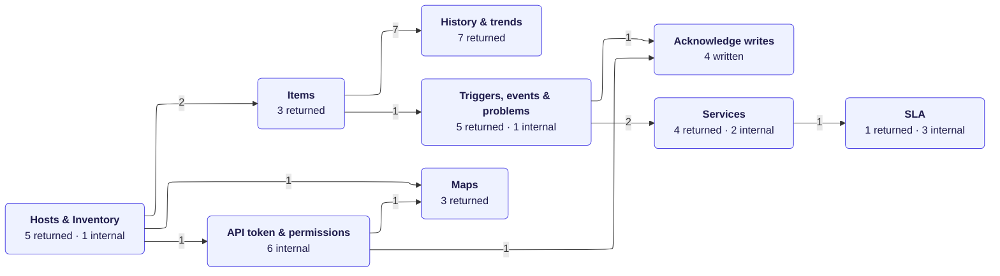
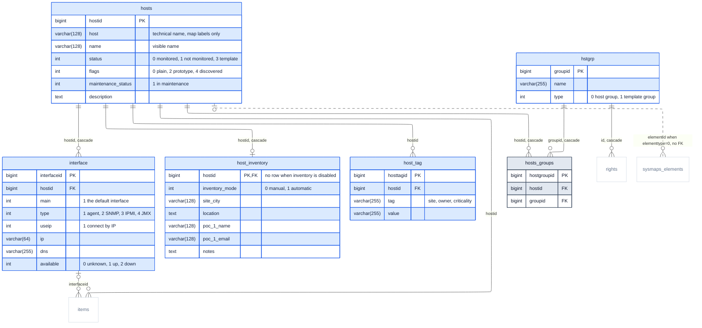
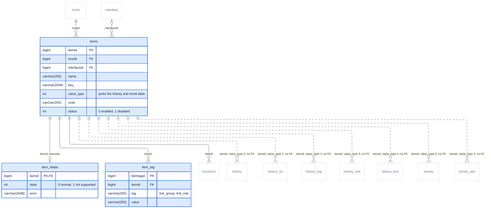
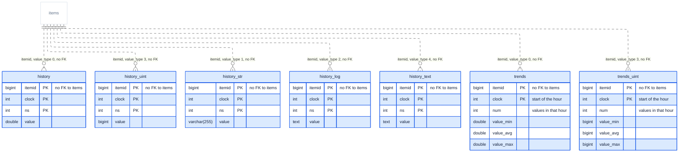
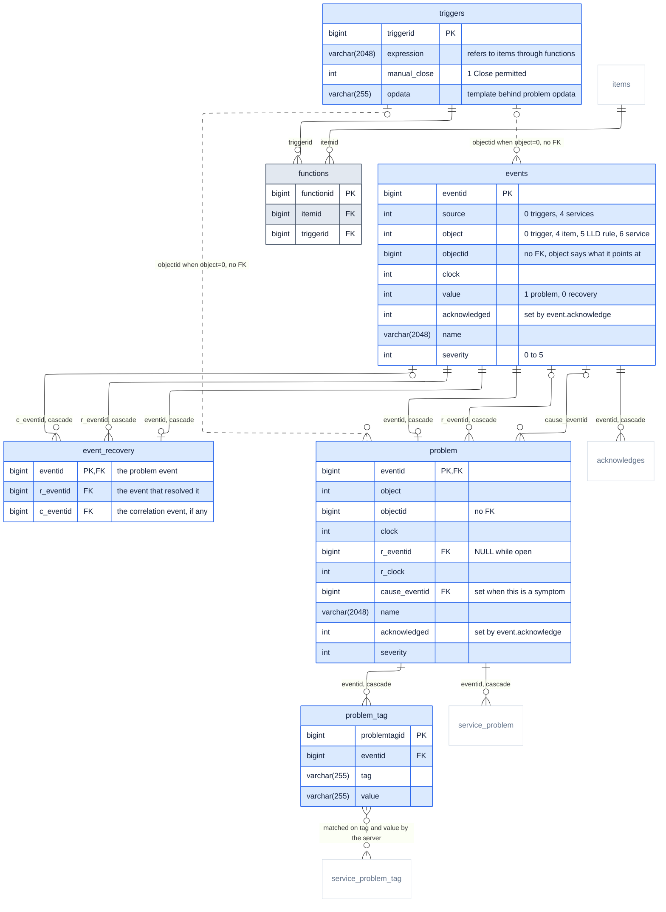
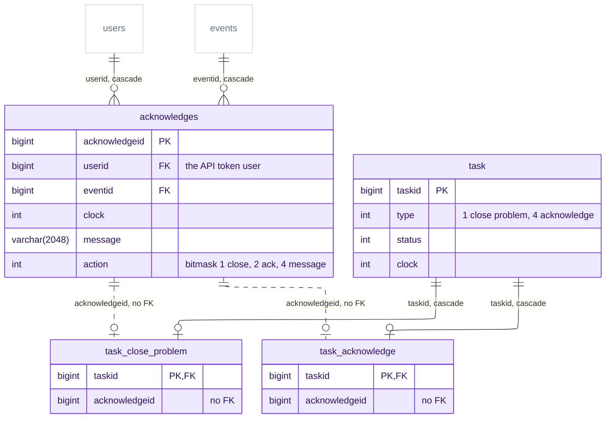
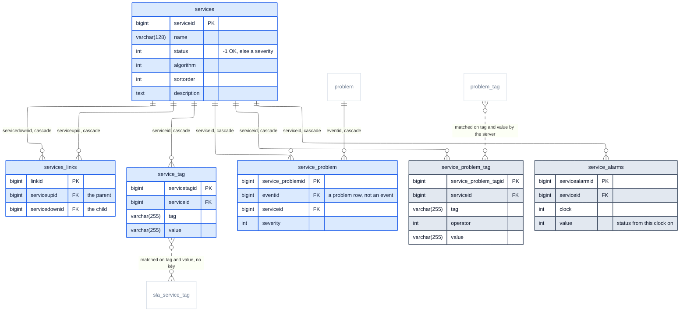
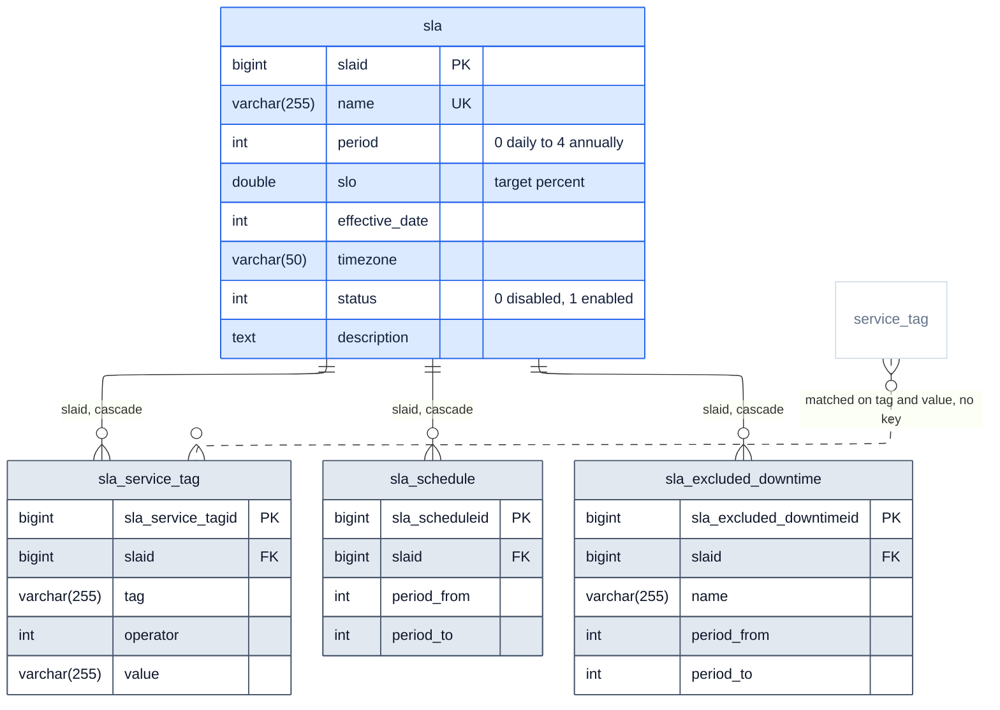
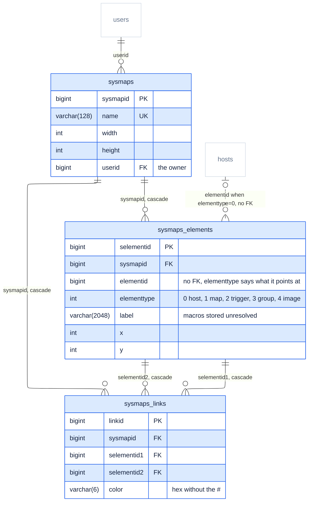
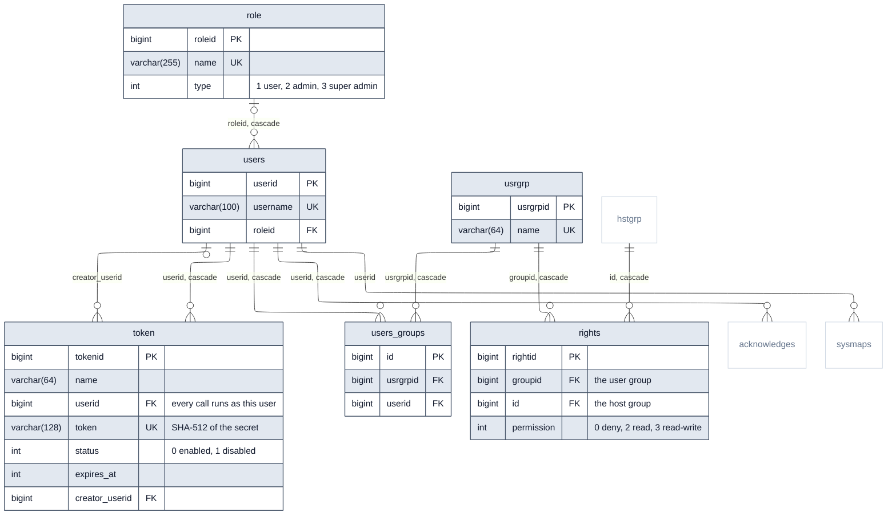

# Database ERD: HCML Monitoring Portal

The MySQL tables behind the portal. [`erd.md`](../../../erd.md) and [`ERD-Domains.md`](../vanilla/ERD-Domains.md) describe the portal's own model: the objects it reads through the Zabbix API and the ones it derives from them. This document goes one level down, to the tables those API calls read and write. The portal still owns no database and sends no SQL; everything here is reached through Zabbix's JSON-RPC API.

The single diagram is [`ERD-Database.mmd`](ERD-Database.mmd), pre-rendered as [`ERD-Database.pdf`](ERD-Database.pdf) (vector, the one to read) and [`ERD-Database.png`](ERD-Database.png). This file is the readable form: which API call touches which table, the domain map, then each domain on its own. One level up, the conceptual model (what the business talks about, with no keys or types) is [`ERD-Conceptual.md`](../conceptual/ERD-Conceptual.md); the index of all three levels is in [`erd.md`](../../../erd.md#the-three-levels).

**Where it comes from.** Every table, column, type, key and foreign key here was read from the running database's `information_schema` on 15 September 2026 (metadata only, no rows. That database is HCML's backup restored into MySQL 8.0 (`zabbix` schema: 203 tables, 1 570 columns, 272 foreign-key columns), and its schema is **identical** to the stock `create.sql` shipped in the `zabbix/zabbix-server-mysql:ubuntu-7.0.30` image) same tables, same columns, same foreign keys, `dbversion` 7000000 / 7000030. Nothing in it is specific to HCML: it holds for any Zabbix 7.0.30 on MySQL. Which call reads which table was checked against the 7.0.30 frontend source in the running `zabbix-web` container; the `C*.php` line numbers below refer to files under `/usr/share/zabbix/include/classes/api/`.

**What is in it.** 45 of the 203 tables: the ones whose rows come back to the portal, the four `event.acknowledge` writes, and the ones Zabbix reads to answer or authorise those calls. Columns are cut the same way (keys, the columns the portal's data comes from, and the discriminators that give a key its meaning. Every foreign key between two tables shown is drawn) 44 of them, except four template self-references (`hosts.templateid`, `items.templateid`, `items.master_itemid`, `triggers.templateid`); 14 more relationships exist only in the data.

**Reading it:** a **solid** line is a `FOREIGN KEY` constraint, labelled with its column, and with *cascade* when deleting the parent row deletes these too · a **dashed** line is a relationship that exists only in the data, which MySQL does not check · **blue** tables return rows to the portal · **purple** tables are written by `event.acknowledge` · **grey** tables are read inside Zabbix and never returned · **white** is a table from another domain, shown without columns so the line has somewhere to land. Cardinalities come from the schema too: a nullable foreign key makes the parent end zero-or-one, and a unique one makes the child end zero-or-one. Every `bigint` is `bigint unsigned`.

> This document is shared by both portals, byte for byte, as is the diagram it describes. They run one
> source tree; only `.env` and the published port differ.

To regenerate the renders after editing the `.mmd`:

```bash
npx @mermaid-js/mermaid-cli -i ERD-Database.mmd -o ERD-Database.pdf -w 2600 -b white --pdfFit
npx @mermaid-js/mermaid-cli -i ERD-Database.mmd -o ERD-Database.png -w 2600 -s 2 -b white
```

The same rules as the other diagram apply: keep `layout: elk` and every `style … fill:none`, or edges disappear under the domain frames. See [`erd.md`](../../../erd.md). Measured with the same script as that diagram, ELK lays this one out with 5 edge crossings and no edge through an unrelated table; dagre gives 18 and 21. `direction LR`, `mergeEdges: true`, the three other ELK node-placement strategies, `considerModelOrder` and two other domain orders also give 5, and a third order gives 6. The two tag-matching lines are written `problem_tag` → `service_problem_tag` and `service_tag` → `sla_service_tag` on purpose: the other way round, ELK sends the first back up around the whole events domain, where it reads as an extra frame. Either order is the same relationship. The per-domain views below have two crossings between them: one in [Services](#services), and one in [Acknowledge writes](#acknowledge-writes) that no layout removes, because `acknowledges` and `task` each point at both task tables, and two parents linked to the same two children always cross once in a layered drawing.

---

## The same model as an `.erd` document

[`ERD-Database.erd`](ERD-Database.erd) holds this schema in the format the ERD Designer app and its
bundled CLI read, written by that CLI on 23 September 2026 from the `.mmd`: 45 tables, 213 columns,
44 foreign keys, the nine domains as canvas bands with a heading memo each, and the same three
colours. It exists because a picture cannot be checked and a JSON model can. Two things it gives you
that the `.mmd` cannot:

```bash
CLI=<erd-designer skill dir>/scripts/erd-agent.cjs
node $CLI run export-ddl --file docs/erd/database/ERD-Database.erd --args '{}'   # 661 lines of MySQL
node $CLI validate --file docs/erd/database/ERD-Database.erd
```

**Neither file is the source of truth on its own.** Two hand-maintained copies of one model is the
shape that has drifted every previous time in this project, so `server/scripts/erd.check.ts` compares
them on every run of the CI workflow and fails on any difference in the table set, the columns, the
types, the primary keys or the foreign keys. Edit one, and either edit the other or the check tells
you. It caught its first real drift within a minute of being written, when the two repos' copies were
one edit apart.

The 14 dashed relationships are deliberately absent from the `.erd`: MySQL has no foreign key for
them, and asserting one would export DDL that is wrong. They are recorded in a memo on the canvas
instead, and the checker ignores dashed lines so that a dashed line turning solid is caught.

---

## Which API call reads which table

The portal calls 13 Zabbix API methods, all through `server/src/zabbix.ts`. Before any of them runs, the call is authorised through `token` and `users`. See [API token & permissions](#api-token--permissions). For the other direction, which entity in `ERD-Mermaid.mmd` each table serves, see [`ERD-DatabaseSchema.md`](../database-schema/ERD-DatabaseSchema.md).

| Method | Called from `server/src/` | Tables |
|---|---|---|
| `host.get` | `queries.ts:109`, `routes/hosts.ts:22`, `:34`, `routes/net.ts:24`, `routes/maps.ts:91`, `routes/reports.ts:65` | `hosts`; `interface`, `hosts_groups` → `hstgrp`, `host_tag`, `host_inventory` for the matching `select*` |
| `hostgroup.get` | `routes/hosts.ts:57`, `routes/reports.ts:68`, `:91` | `hstgrp` (host groups only), `hosts_groups` |
| `item.get` | `routes/hosts.ts:69`, `:89`, `routes/links.ts:105`, `routes/net.ts:32`, `:56`, `:70`, `routes/analytics.ts:468`, `routes/reports.ts:66` | `items`, `item_rtdata`, `item_tag`, `hosts`; the history tables for `lastvalue`, `lastclock`, `prevvalue` |
| `history.get` | `routes/history.ts:17`, `:43`, `routes/analytics.ts:500` | one of `history`, `history_str`, `history_log`, `history_uint`, `history_text`, chosen by the `history` parameter |
| `trend.get` | `routes/history.ts:61`, `routes/analytics.ts:485` | `trends` for float items, `trends_uint` for unsigned ones |
| `trigger.get` | `queries.ts:48`, `routes/reports.ts:67` | `triggers`; `functions` → `items` → `hosts` for `selectHosts` |
| `problem.get` | `queries.ts:29` | `problem`, `problem_tag`; `event_suppress` (not drawn) for `suppressed`; `triggers` for `opdata` |
| `event.get` | `routes/analytics.ts:128`, `:152`, `routes/reports.ts:25` | `events`, `event_recovery`; `functions` → `items` → `hosts` for `selectHosts` |
| `service.get` | `routes/services.ts:113`, `routes/sla.ts:58` | `services`, `services_links`, `service_tag`, `service_problem`, then `events` for problem names |
| `sla.get` | `routes/sla.ts:33`, `routes/services.ts:73` | `sla` |
| `sla.getsli` | `routes/sla.ts:50`, `routes/services.ts:85` | `sla`, `sla_schedule`, `sla_excluded_downtime`; services matched through `sla_service_tag`, with their status history from `service_alarms` |
| `map.get` | `routes/maps.ts:59`, `:69`, `routes/net.ts:84` | `sysmaps`, `sysmaps_elements`, `sysmaps_links`, plus `sysmap_element_trigger` and `sysmaps_link_triggers` (not drawn) |
| `event.acknowledge` | `routes/actions.ts:83` | **writes** `acknowledges`; updates `acknowledged` on `events` and `problem`; adds `task` with `task_close_problem` to close, or with `task_acknowledge` for the server to act on |

---

## Domain map

Nine domains, and how many relationships cross between each pair, foreign keys and data-only ones together.



| Domain | Tables | Internal | Crossing |
|---|---:|---:|---:|
| [Hosts & Inventory](#hosts--inventory) | 6 | 5 | 4 |
| [Items](#items) | 3 | 2 | 10 |
| [History & trends](#history--trends) | 7 | 0 | 7 |
| [Triggers, events & problems](#triggers-events--problems) | 6 | 10 | 4 |
| [Acknowledge writes](#acknowledge-writes) | 4 | 4 | 2 |
| [Services](#services) | 6 | 6 | 3 |
| [SLA](#sla) | 4 | 3 | 1 |
| [Maps](#maps) | 3 | 4 | 2 |
| [API token & permissions](#api-token--permissions) | 6 | 6 | 3 |

---

## Hosts & Inventory

The estate. `hosts` also holds templates (`status = 3`) and host prototypes (`flags = 2`); `host.get` leaves both out unless asked (`CHost.php:98`, `:327`). `hstgrp` likewise holds template groups as `type = 1`, and `hostgroup.get` returns only `type = 0` (`CHostGroup.php:120`). A host with inventory disabled has no `host_inventory` row at all (`CHost.php:845`), which the API reports as `[]`.



*Grey, no attributes:* `items`, `rights`, `sysmaps_elements`. Detailed in [Items](#items), [API token & permissions](#api-token--permissions), [Maps](#maps).

---

## Items

`items` is the definition; the live state is elsewhere. `state` and `error` sit in `item_rtdata`, and `lastvalue`, `lastclock` and `prevvalue` are not columns anywhere: `item.get` reads them back from the history tables, looking no further back than the history display period, 24 h by default (`CItem.php:1781`). On a backup whose newest values are older than that, they come back blank, which is why the Graphs page anchors its window on `history.get`'s newest value instead.



*Grey, no attributes:* `functions`, `history`, `history_log`, `history_str`, `history_text`, `history_uint`, `hosts`, `interface`, `trends`, `trends_uint`. Detailed in [Triggers, events & problems](#triggers-events--problems), [History & trends](#history--trends), [History & trends](#history--trends), [History & trends](#history--trends), [History & trends](#history--trends), [History & trends](#history--trends), [Hosts & Inventory](#hosts--inventory), [Hosts & Inventory](#hosts--inventory), [History & trends](#history--trends), [History & trends](#history--trends).

---

## History & trends

Where the values live, joined by relationships with no foreign key. Each item writes to one history table and at most one trend table, picked by its `value_type` (`CHistoryManager.php:1741`, `CTrend.php:147`); `history_bin`, for binary items, exists too but nothing in the portal reads it. `itemid` is part of each primary key yet references nothing. In HCML's backup these are by far the largest tables (`history_uint` and `trends_uint` are about 3 GB each of the 8 GB dump) which is why every portal query into them is bounded in time.



*Grey, no attributes:* `items`. Detailed in [Items](#items).

---

## Triggers, events & problems

A problem lives in two tables. `events` keeps every event, problems and recoveries alike, with the pairing in `event_recovery`; `problem` holds the problems themselves, `r_eventid` filled in once resolved. `problem.get` reads the second, `event.get` the first (`CEvent.php:281`, `:566`). Neither points at its trigger with a key (`objectid` means a trigger only when `object = 0`) and `triggers` has no host column: `trigger.get` and `event.get` reach hosts through `functions` and `items` (`CTrigger.php:138`, `CEvent.php:226`). One expression can use items from several hosts, which is why the API answers with a host array and the portal's `hosts[0]` can lose some.



*Grey, no attributes:* `acknowledges`, `items`, `service_problem`, `service_problem_tag`. Detailed in [Acknowledge writes](#acknowledge-writes), [Items](#items), [Services](#services), [Services](#services).

---

## Acknowledge writes

The only writes the portal can cause, all from one `event.acknowledge` call (`routes/actions.ts:83`). The `acknowledges` row and the `acknowledged` flag on `events` and `problem` change at once (`CEvent.php:1165`–`1203`). **Closing does not:** it queues `task` and `task_close_problem` (`:1228`), and the Zabbix server's task manager generates the recovery afterwards, so a closed problem can stay on the portal's list for a few seconds.



*Grey, no attributes:* `events`, `users`. Detailed in [Triggers, events & problems](#triggers-events--problems), [API token & permissions](#api-token--permissions).

---

## Services

Services form a DAG because `services_links` is a plain link table: nothing stops a child from appearing under two parents. A service's root causes are rows in `service_problem`, which the Zabbix server writes when a problem's tags match the service's `service_problem_tag` rules; they reference `problem`, not `events`, and cascade away with it (`CService.php:922`). Problem names come from a second `event.get` (`CService.php:944`). `service_alarms` is each service's status history.



*Grey, no attributes:* `problem`, `problem_tag`, `sla_service_tag`. Detailed in [Triggers, events & problems](#triggers-events--problems), [Triggers, events & problems](#triggers-events--problems), [SLA](#sla).

---

## SLA

No table stores an SLI. `sla.getsli` loads the SLA with its schedule and excluded downtimes, asks `service.get` for the services it covers together with a status timeline replayed from `service_alarms`, and computes the percentages in PHP (`CSla.php:1047`). Nothing keys an SLA to its services: `sla_service_tag` rows are matched against `service_tag` when the query runs, which is why `sla.getsli` answers with a parallel `serviceids` array rather than keyed rows.



*Grey, no attributes:* `service_tag`. Detailed in [Services](#services).

---

## Maps

`sysmaps_elements.elementid` holds a host, map or host-group id depending on `elementtype`, so no foreign key can back it; only trigger elements use a separate, keyed table, `sysmap_element_trigger` (`CMap.php:385`–`403`, not drawn). Labels are stored with their macros unresolved, `{HOSTNAME} ({HOST.IP})`, and the portal resolves them itself.



*Grey, no attributes:* `hosts`, `users`. Detailed in [Hosts & Inventory](#hosts--inventory), [API token & permissions](#api-token--permissions).

---

## API token & permissions

Every API call runs as a Zabbix user. The portal's Bearer token is looked up by its SHA-512 hash, enabled tokens only (`CUser.php:2976`–`2978`), and the call gets that user's role. For anyone below Super admin, `host.get` adds a permission join (`CHost.php:179`–`192`) on permission sets Zabbix compiles from `rights` (`ugset`, `hgset`, `permission`, not drawn). A token owned by a restricted user would silently shrink every portal page, with no error.



*Grey, no attributes:* `acknowledges`, `hstgrp`, `sysmaps`. Detailed in [Acknowledge writes](#acknowledge-writes), [Hosts & Inventory](#hosts--inventory), [Maps](#maps).

---

## Relationships MySQL does not enforce

The dashed lines. Each is a relationship the portal relies on, held together only by Zabbix's own code.

| From | To | Column | What makes the link |
|---|---|---|---|
| `items` | `history`, `history_str`, `history_log`, `history_uint`, `history_text` | `itemid` | The item's `value_type` picks the table |
| `items` | `trends`, `trends_uint` | `itemid` | Float items trend to `trends`, unsigned ones to `trends_uint` |
| `triggers` | `events`, `problem` | `objectid` | Only when `object = 0`; items, LLD rules and services reuse the column |
| `hosts` | `sysmaps_elements` | `elementid` | Only when `elementtype = 0`; maps and host groups reuse the column |
| `acknowledges` | `task_close_problem`, `task_acknowledge` | `acknowledgeid` | Written in the same `event.acknowledge` call |
| `service_tag` | `sla_service_tag` | `tag`, `value` | Matched when the query runs, using the SLA rule's `operator` |
| `problem_tag` | `service_problem_tag` | `tag`, `value` | Matched by the Zabbix server, which then writes `service_problem` |

With no key behind them, MySQL will not stop orphans. Zabbix deletes the history, trends and events of a deleted item or trigger later, through its housekeeper, and automatic housekeeping is switched off on this restored copy (`ZBX_HOUSEKEEPINGFREQUENCY=0` in the Proto1 dev stack), so such rows stay until someone runs it.

---

## Enum columns

Values from `include/defines.inc.php` in the same frontend.

| Column | Values |
|---|---|
| `hosts.status` | `0` monitored · `1` not monitored · `3` template |
| `hosts.flags` | `0` plain · `2` prototype · `4` discovered |
| `hstgrp.type` | `0` host group · `1` template group |
| `host_inventory.inventory_mode` | `0` manual · `1` automatic, disabled (`-1`) means there is no row |
| `interface.type` | `1` agent · `2` SNMP · `3` IPMI · `4` JMX |
| `interface.available` | `0` unknown · `1` available · `2` unavailable |
| `items.status` | `0` enabled · `1` disabled |
| `items.value_type` | `0` float · `1` character · `2` log · `3` unsigned · `4` text · `5` binary |
| `item_rtdata.state` | `0` normal · `1` not supported |
| `events.source` | `0` triggers · `1` discovery · `2` autoregistration · `3` internal · `4` services |
| `events.object` | `0` trigger · `1` discovered host · `2` discovered service · `3` autoregistered host · `4` item · `5` LLD rule · `6` service |
| `events.value` | `1` problem · `0` recovery |
| `acknowledges.action` | bitmask, `1` close · `2` acknowledge · `4` message · `8` change severity · `16` unacknowledge · `32` suppress · `64` unsuppress · `128` rank as cause · `256` rank as symptom |
| `task.type` | `1` close problem · `4` acknowledge, among others |
| `services.status` | `-1` OK · otherwise the severity that propagated up |
| `sla.period` | `0` daily · `1` weekly · `2` monthly · `3` quarterly · `4` annually |
| `sla.status` | `0` disabled · `1` enabled |
| `sysmaps_elements.elementtype` | `0` host · `1` map · `2` trigger · `3` host group · `4` image |
| `token.status` | `0` enabled · `1` disabled |
| `role.type` | `1` User · `2` Admin · `3` Super admin |
| `rights.permission` | `0` deny · `2` read · `3` read-write |

---

## Re-checking it against a database

The diagram is only as true as the schema it was read from. After a Zabbix upgrade, export the same metadata and compare before trusting it. Neither query reads a row.

```sql
-- every column, with its type, nullability and key
SELECT table_name, column_name, column_type, is_nullable, column_key
  FROM information_schema.columns
 WHERE table_schema = 'zabbix'
 ORDER BY table_name, ordinal_position;

-- every foreign key, with its delete rule
SELECT k.table_name, k.column_name, k.referenced_table_name, k.referenced_column_name, r.delete_rule
  FROM information_schema.key_column_usage k
  JOIN information_schema.referential_constraints r
    ON r.constraint_schema = k.constraint_schema
   AND r.constraint_name = k.constraint_name
   AND r.table_name = k.table_name
 WHERE k.table_schema = 'zabbix' AND k.referenced_table_name IS NOT NULL
 ORDER BY k.table_name, k.column_name;
```

On 15 September these returned 1 570 columns across 203 tables and 272 foreign-key columns, matching the `CREATE TABLE` and `ALTER TABLE … FOREIGN KEY` statements in `/usr/share/doc/zabbix-server-mysql/create.sql.gz` inside the `zabbix-server` container one for one.
