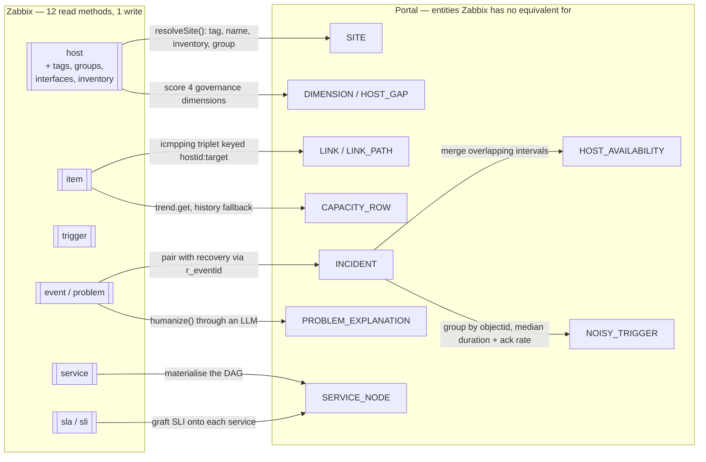

# Data model: HCML Monitoring Portal

An entity-relationship view of the portal. Read [README.md](README.md) for the project overview and
[setup.md](setup.md) for how each subsystem works.

**The complete schema lives in [`ERD-Mermaid.mmd`](docs/erd/vanilla/ERD-Mermaid.mmd)**: one unified `erDiagram`
covering both layers and the derivation edges between them, which the two split diagrams below cannot
show. Its entities are grouped into nine domain subgraphs and colour-coded by layer: blue `ZBX_*` read
from Zabbix, green derived by the portal, amber local to it.

**If you only want to read it, start with [`ERD-Domains.md`](docs/erd/vanilla/ERD-Domains.md)**: the same schema split
into a one-screen domain map plus one detail diagram per domain. Forty-odd entities in a single
picture is a lot to take in; that file is the readable form, and nothing in it differs from the
`.mmd`. Pre-rendered copies of the single diagram sit alongside it:

- [`ERD-Mermaid.pdf`](docs/erd/vanilla/ERD-Mermaid.pdf): **vector**; zoom to any attribute and it stays sharp, and the
  text is searchable. The one to read.
- [`ERD-Mermaid.png`](docs/erd/vanilla/ERD-Mermaid.png): 5168 px wide, rendered at 2× scale, for slides and documents.

**The tables underneath are in [`ERD-Database.md`](docs/erd/database/ERD-Database.md).** This diagram is the portal's
model: what it reads through the Zabbix API and what it derives. `ERD-Database.md`, with its own
`.mmd`, `.pdf` and `.png`, goes one level down to the 45 MySQL tables those API calls read and write,
with every column, key and foreign key taken from the live database's schema. Each blue entity here
names its table in its header, after the dot. [`ERD-DatabaseSchema.md`](docs/erd/database-schema/ERD-DatabaseSchema.md) maps
every one of them to its tables, as a table and as a diagram.

To regenerate after editing the `.mmd`:

```bash
npx @mermaid-js/mermaid-cli -i ERD-Mermaid.mmd -o ERD-Mermaid.pdf -w 2600 -b white --pdfFit
npx @mermaid-js/mermaid-cli -i ERD-Mermaid.mmd -o ERD-Mermaid.png -w 2600 -s 2 -b white
```

`--pdfFit` sizes the page to the chart; without it the diagram is squeezed onto A4 and unreadable.

**The file declares `layout: elk` in its frontmatter, and that matters.** Mermaid's default engine
(dagre) lays this graph out with 16 edge crossings and 9 edges cut straight through unrelated entity
boxes; ELK brings those to 2 and zero. Do not remove that frontmatter block, and keep
`mergeEdges: false`, setting it true raises the crossings to 7. `direction TB` is deliberate too:
`LR` scores identically on crossings but produces a 5.8:1 canvas that shrinks the text.

**Every `subgraph` must keep `fill:none`, and that is not cosmetic.** Mermaid paints cluster
rectangles *after* the relationship lines, and the default theme fills them opaque (`#ffffde`), so a
filled domain frame hides every edge that lies under it. On 14 September, with the fill left on, **33 of the then 46 edges
were completely invisible** in the rendered PNG and PDF and another 11 were partly covered: labels
such as *"selectTags"* floated with nothing attached to them. Nothing had been deleted: the `.mmd`
source and the SVG both still held all 46 edges, they were simply painted over. The file sets
`style <DOMAIN> fill:none,stroke:#94a3b8` for each of the nine domains, and `ERD-Database.mmd` does
the same for its own; remove those lines and the relationships vanish again.

Five Mermaid quirks to know before editing: `%%` comments may not appear *before* the `erDiagram`
keyword; a bare `%%` line with no text after it is a parse error; ELK must be selected through
frontmatter, not a `%%{init}%%` directive; `erDiagram`'s `style` grammar takes only simple
`key:value` pairs, both `stroke-width:1.5px` and `stroke-dasharray:5 4` are lexer errors, which is
why the domain frames set `fill` and `stroke` and nothing else; and an entity's header can differ
from its name (`ZBX_HOST["ZBX_HOST · hosts"]` is how the blue entities show their table) but
relationships and `class` lines must keep using the bare name.

The diagrams in this document are the annotated walk-through; that file is the schema.

> This document is shared by both portals, byte for byte. See [The two portals](#the-two-portals).

---

## The three levels

The data model is documented at three levels of abstraction. Nothing has been renamed to say so; this table
is the index.

| Level | The question it answers | Artefact | Notation |
|---|---|---|---|
| **Conceptual** (MCD) | What the business talks about | [`erd/Conceptual/ERD-Conceptual.md`](docs/erd/conceptual/ERD-Conceptual.md) | Merise: entities and named associations, `(min,max)` on each leg. No keys, no types |
| **Logical** (MLD) | What the portal reads and derives | [`erd/Vanilla/ERD-Domains.md`](docs/erd/vanilla/ERD-Domains.md), from [`erd/Vanilla/ERD-Mermaid.mmd`](docs/erd/vanilla/ERD-Mermaid.mmd) | Crow's foot; attributes named, PK/FK marked |
| **Physical** (MPD) | What MySQL actually stores | [`erd/Database/ERD-Database.md`](docs/erd/database/ERD-Database.md) | Crow's foot; real MySQL types, PK/FK, cascade |
| *Bridge* | Which logical entity uses which table | [`erd/Database-Schema/ERD-DatabaseSchema.md`](docs/erd/database-schema/ERD-DatabaseSchema.md) | Flowchart |

The document you are reading is the narrative for the logical level, and the entry point to all four.

The conceptual level is the only one that cannot be regenerated from anything: the logical model can be read
off the API calls and the physical one off `information_schema`, but a conceptual entity is a judgement.
`ERD-Conceptual.md` ends with the list of code changes that oblige a change to it.

---

## 1. Why this is not a table diagram

**The portal owns no database.** There is no `pg`, `prisma`, `knex` or `sequelize` dependency, no SQL
anywhere in the codebase, no `.sql` file, and `docker-compose.yml` defines exactly two services,
`portal-bff` and `portal-web`. Neither is a datastore.

Every fact the portal displays is Zabbix's, read over JSON-RPC through the single client in
[`server/src/zabbix.ts`](server/src/zabbix.ts). The only persistence in the process is an in-memory
TTL `Map` in [`server/src/cache.ts`](server/src/cache.ts), which is discarded on restart.

So this ERD does not show the portal's tables and foreign keys, it has none. What it shows, and
what actually matters when working on this codebase is a **two-layer domain model**:

| Layer | What it is | Where it lives |
|---|---|---|
| **Zabbix entities** | The objects the portal reads, and *only the fields it actually asks for* | Zabbix's MySQL database, reached via 12 read methods and 1 write |
| **Portal entities** | Objects the portal computes that Zabbix has no equivalent for | Nowhere: built per request, cached briefly, never stored |

The tables do exist; they are Zabbix's. Since 15 September the dev stack runs Zabbix 7.0.30 on MySQL
8.0, restored from HCML's own backup, and [`ERD-Database.md`](docs/erd/database/ERD-Database.md) draws the 45 of its
203 tables that the portal's 13 API methods read or write. Every column, key and foreign key there
was taken from the live schema, which is identical to stock Zabbix 7.0.30. Each blue entity below
names its table in its header; [`ERD-DatabaseSchema.md`](docs/erd/database-schema/ERD-DatabaseSchema.md) lists them all.

The second layer is the point of the project. `Site`, `Link`, `Incident`, the inventory scorecard and
the availability report are not in Zabbix in any form; they are arithmetic and grouping the portal
performs so a NOC can read them.

---

## 2. Layer overview

How Zabbix objects become portal objects. Each arrow is labelled with the derivation.



---

## 3. Zabbix entities, as actually consumed

This is **not** Zabbix's full schema: that is 203 tables. These are the entities the portal
reads, carrying only the fields the code genuinely asks for. Everything else Zabbix offers is
deliberately absent, and that absence is itself useful information: it is the true coupling surface
between this project and Zabbix.

```mermaid
erDiagram
    HOST ||--o{ HOST_INTERFACE : "selectInterfaces"
    HOST ||--o| HOST_INVENTORY : "selectInventory"
    HOST ||--o{ HOST_TAG : "selectTags"
    HOST }o--o{ HOST_GROUP : "selectHostGroups"
    HOST ||--o{ ITEM : "hostids"
    ITEM ||--o{ ITEM_TAG : "selectTags"
    ITEM ||--o{ HISTORY : "itemids"
    ITEM ||--o{ TREND : "itemids"
    TRIGGER }o--|| HOST : "selectHosts, first only"
    PROBLEM }o--|| TRIGGER : "objectid when object=0"
    PROBLEM ||--o{ PROBLEM_TAG : "selectTags"
    EVENT }o--|| TRIGGER : "objectid, object=0"
    EVENT ||--o| EVENT : "r_eventid, recovery row"
    SERVICE ||--o{ SERVICE : "selectChildren, a DAG"
    SERVICE ||--o{ SERVICE_PROBLEM_EVENT : "selectProblemEvents"
    SERVICE ||--o{ SERVICE_TAG : "selectTags"
    SLA ||--o{ SLI : "sla.getsli, positional"
    SLI }o--|| SERVICE : "serviceids index"
    MAP ||--o{ MAP_SELEMENT : "selectSelements"
    MAP ||--o{ MAP_LINK : "selectLinks"
    HOST |o--o{ MAP_SELEMENT : "elements[0].hostid, host elements only"

    EVENT["EVENT · events"]
    ITEM_TAG["ITEM_TAG · item_tag"]
    PROBLEM_TAG["PROBLEM_TAG · problem_tag"]
    SERVICE_PROBLEM_EVENT["SERVICE_PROBLEM_EVENT · service_problem"]
    SERVICE_TAG["SERVICE_TAG · service_tag"]

    HOST["HOST · hosts"] {
        string hostid PK
        string host "technical name, map labels only"
        string name "the visible name"
        string status "0 monitored, 1 not monitored"
        string maintenance_status "1 = in maintenance"
        string description
    }
    HOST_INTERFACE["HOST_INTERFACE · interface"] {
        string ip
        string dns "map labels only"
        string useip "1 = connect by IP"
        string main "1 = the default interface"
        string type "1 agent, 2 SNMP, 3 IPMI, 4 JMX"
        string available "0 unknown, 1 up, 2 down"
    }
    HOST_INVENTORY["HOST_INVENTORY · host_inventory"] {
        string site_city "site signal, rank 2"
        string location "site signal, fallback"
        string poc_1_name "owner signal"
        string poc_1_email "owner signal"
        string notes "requested but never read"
    }
    HOST_TAG["HOST_TAG · host_tag"] {
        string tag "site, owner, criticality"
        string value
    }
    HOST_GROUP["HOST_GROUP · hstgrp"] {
        string groupid PK
        string name
    }
    ITEM["ITEM · items"] {
        string itemid PK
        string key_ "parsed for icmpping params"
        string name
        string value_type "0 float, 1 char, 2 log, 3 uint, 4 text"
        string units
        string lastvalue "not a column, taken from history"
        string lastclock "blank beyond the history period, 24h default"
        string prevvalue "not a column, taken from history"
        string state "0 normal, 1 not supported, in item_rtdata"
    }
    TRIGGER["TRIGGER · triggers"] {
        string triggerid PK
        string manual_close "1 = Close permitted"
    }
    PROBLEM["PROBLEM · problem"] {
        string eventid PK
        string objectid FK "the trigger id, no constraint in MySQL"
        string object "0 = trigger, the only kind handled"
        string name "the notification text"
        string severity "0 to 5"
        string clock "unix seconds"
        string r_eventid "0 means still open"
        string acknowledged "0 or 1"
        string opdata "the live value"
        string suppressed "declared, never branched on"
    }
    SERVICE["SERVICE · services"] {
        string serviceid PK
        string name
        number status "-1 OK, else severity"
        string algorithm "carried through, never mapped"
        string sortorder
        string description
    }
    SLA["SLA · sla"] {
        string slaid PK
        string name
        string slo "target percent"
        string period "0 daily to 4 annually"
        string status "0 disabled, 1 enabled"
        string timezone
        string description
    }
    SLI["SLI · computed, no table"] {
        number sli "achieved percent"
        number uptime "seconds"
        number downtime "seconds"
        number error_budget "seconds, negative = missed"
    }
    HISTORY["HISTORY · five history tables"] {
        string itemid FK "no constraint in MySQL"
        string clock "the newest one anchors a graph window"
        string value
    }
    TREND["TREND · trends, trends_uint"] {
        string itemid FK "no constraint in MySQL"
        string value_avg
        string value_max
    }
    MAP["MAP · sysmaps"] {
        string sysmapid PK
        string name
        string width
        string height
    }
    MAP_SELEMENT["MAP_SELEMENT · sysmaps_elements"] {
        string selementid PK
        string label
        string x
        string y
        string elementtype "0 host, 1 map, 2 trigger, 3 group, 4 image"
        string hostid FK "elements[0], host elements only"
    }
    MAP_LINK["MAP_LINK · sysmaps_links"] {
        string linkid PK
        string selementid1 FK
        string selementid2 FK
        string color "hex without the #"
    }
```



### What the portal deliberately does not read

Worth stating, because it bounds the blast radius of a Zabbix upgrade:

- **`trigger`**: only `triggerid`, `manual_close` and the host. Not `expression`, `priority`,
  `status`, `value`, `lastchange`, `comments` or dependencies. Problem name and severity always come
  from the **event**, never from the trigger.
- **`host`**: the technical `host` name only for map labels; not proxy, template links or `flags`.
  `host.get` still filters on `flags` and `status` for it: the `hosts` table also holds templates
  (`status` 3) and host prototypes (`flags` 2), and neither is ever returned.
- **`host inventory`**: 5 of its 70 fields.
- **Whole entities never touched**: `user`, `usergroup`, `template`, `action`, `mediatype`,
  `maintenance`, `script`, `dashboard`, `httptest`, `valuemap`, `proxy`, `correlation`,
  `discoveryrule`. Portal authentication is entirely local (`PORTAL_USERS` in the environment), not
  Zabbix users, although every Zabbix call runs *as* the Zabbix user that owns the API token, and
  that user's role and host-group rights decide what `host.get` returns
  ([API token & permissions](docs/erd/database/ERD-Database.md#api-token--permissions)).
- **`map_selement.elements[]`**: followed for host elements only. `/api/maps/detail` resolves each
  host element's label macros and attaches its live problems (`MAP_ELEMENT`); map, trigger and
  host-group elements are still plain labelled boxes. No foreign key backs the link:
  `sysmaps_elements.elementid` means a host, map or host group depending on `elementtype`, so MySQL
  cannot enforce it.

---

## 4. Portal-derived entities

None of these exist in Zabbix. Each is built per request from the entities above.

```mermaid
erDiagram
    SITES_RESPONSE ||--o{ SITE : "sites, worst first"
    SITE ||--|{ SITE_HOST : "hosts"
    LINKS_RESPONSE ||--o{ LINK : "links"
    LINKS_RESPONSE ||--o{ LINK_PATH : "paths"
    LINK_PATH ||--|{ LINK : "grouped by link_group tag"
    SERVICES_RESPONSE ||--o{ SERVICE_NODE : "tree roots"
    SERVICE_NODE ||--o{ SERVICE_NODE : "children, a DAG"
    SERVICE_NODE ||--o| SERVICE_SLA : "first SLA wins"
    AVAILABILITY_REPORT ||--o{ HOST_AVAILABILITY : "hosts"
    HOST_AVAILABILITY ||--|{ INCIDENT : "merged intervals"
    NOISE_REPORT ||--o{ NOISY_TRIGGER : "triggers"
    NOISY_TRIGGER ||--|{ INCIDENT : "grouped by objectid"
    SCORECARD ||--|{ DIMENSION : "exactly 4"
    SCORECARD ||--o{ HOST_GAP : "gaps"
    SCORECARD ||--o{ GROUP_SCORE : "groups"
    CAPACITY_REPORT ||--|{ CAPACITY_METRIC : "exactly 3"
    CAPACITY_METRIC ||--o{ CAPACITY_ROW : "rows"
    AGING_REPORT ||--|{ AGING_BUCKET : "exactly 4"
    PROBLEM_EXPLANATION ||--o{ TAG_EXPLAINED : "one per input tag"
    CHAT_SNAPSHOT ||--o{ SITE : "up to 30, worst first"
    CHAT_SNAPSHOT ||--o{ SERVICE_NODE : "up to 20 degraded"

    SITE {
        string name PK "derived, never stored"
        number total
        number available
        number unavailable
        number unknown
        number maintenance
        number disabled
        number problems
        number unacknowledged
        number worst "highest severity, -1 when clear"
    }
    SITE_HOST {
        string hostid PK
        string name
        string availability "worst-wins over interfaces"
        string siteSource "tag, name, inventory or group"
    }
    LINK {
        string id PK "hostid:target"
        string host
        string target "ping destination from the item key"
        string label
        boolean up
        number loss "percent"
        number latency "ms"
        number jitter "rttMax minus rttMin"
        string state "up, degraded, down, unknown"
        string group "link_group tag"
        string role "link_role tag"
    }
    LINK_PATH {
        string name PK "the link_group value"
        string state "down only when every leg is down"
    }
    SERVICE_NODE {
        string serviceid PK
        number status "-1 OK, else severity"
        number worst "max status in the subtree"
        number descendants "distinct ids below, DAG-safe"
    }
    SERVICE_SLA {
        string slaid PK
        number slo
        number sli
        number errorBudget "seconds"
        boolean meeting "sli >= slo"
    }
    INCIDENT {
        string eventid PK
        string objectid FK "trigger"
        string hostid FK
        number start "clipped to the window"
        number end "recovery clock, or now"
        boolean resolved
        boolean acknowledged
    }
    HOST_AVAILABILITY {
        string hostid PK
        number availability "percent, overlaps merged"
        number downtime "seconds"
        number incidents
        number longest
    }
    NOISY_TRIGGER {
        string objectid PK
        number count
        number medianDuration "median, not mean"
        number ackRate "0 to 1"
        boolean stillOpen
        string flags "flapping, unactioned, chronic"
    }
    DIMENSION {
        string key PK "naming, site, owner, criticality"
        number present
        number total
        number pct
        boolean scored "false when not configured"
    }
    HOST_GAP {
        string hostid PK
        string site
        string missing "which dimensions are absent"
    }
    CAPACITY_ROW {
        string itemid PK
        number avg
        number max
        string source "trend, history or none"
    }
    MAP_ELEMENT {
        string selementid PK
        string labelText "HOSTNAME and HOST.IP macros resolved"
        string hostid FK "host elements only"
        number problems "open problems on that host"
        number maxSeverity "worst of them, -1 when clear"
    }
    PROBLEM_EXPLANATION {
        string summary
        string businessImpact
        string recommendation
    }
    CHAT_SNAPSHOT {
        number generatedAt PK "one per assistant message"
        number hosts
        number sites
        number problems
        number unacknowledged
        number slas
        number degradedServices
        boolean truncated "a cap fired, the view is partial"
    }
```



---

## 5. Derivation reference

Where each derived entity is built, and from what.

| Entity | Built by | Inputs |
|---|---|---|
| `Site`, `SiteHost` | `getSites()`, [`routes/sites.ts`](server/src/routes/sites.ts) | `getHostsWithMeta()` + `getProblems()` |
| `Link`, `LinkPath` | `getLinks()`, [`routes/links.ts`](server/src/routes/links.ts) | `item.get` on `icmpping*`, plus item tags |
| `Incident` | `fetchIncidents()`, [`routes/analytics.ts`](server/src/routes/analytics.ts) | `event.get` problems + a batched recovery lookup |
| `HostAvailability` | `getAvailability()` | `Incident[]` grouped by host, intervals merged |
| `NoisyTrigger` | `getNoise()` | `Incident[]` grouped by trigger |
| `AgingReport` | `getAging()` | `getProblems()`, unacknowledged only |
| `CapacityRow` | `getCapacity()` | `item.get` + `trend.get`, falling back to `history.get` |
| `MapElement` | `/api/maps/detail`: [`routes/maps.ts`](server/src/routes/maps.ts) | `map.get` elements, one `host.get` for label macros, and `getProblems()` |
| `Dimension`, `HostGap` | `getScorecard()`, [`routes/inventory.ts`](server/src/routes/inventory.ts) | `getHostsWithMeta()` |
| `ServiceNode` | `getServiceTree()`, [`routes/services.ts`](server/src/routes/services.ts) | `service.get` + one `sla.getsli` per SLA |
| `SlaSli` | `getSli()`, [`routes/sla.ts`](server/src/routes/sla.ts) | `sla.getsli` flattened, names from `service.get` |
| `ProblemExplanation` | `humanize()`: [`server/src/ai.ts`](server/src/ai.ts) | one problem, reshaped and sent to an LLM |
| `ChatSnapshot` | `buildSnapshot()`: [`server/src/chat.ts`](server/src/chat.ts) | problems + sites + SLA + services, capped and rendered as plain text |

### How a site is resolved

`Site` has no Zabbix equivalent at all, so its definition lives entirely in code:
`resolveSite()` in [`routes/sites.ts`](server/src/routes/sites.ts). First match wins:

1. **Host tag** named by `SITE_TAG` (default `site`) → `source: 'tag'`
2. **The host's own name**, parsed by `siteFromHostName()` in
   [`naming.ts`](server/src/naming.ts) against HCML's `<code>.<class>.<seq>` convention, or an
   `INET:` / `SERVER:` prefix → `source: 'name'`
3. **Inventory** `site_city`, else `location` → `source: 'inventory'`
4. **Host group**: with `SITE_GROUP_PREFIX` set, the first group with that prefix, prefix stripped;
   without it, the first group verbatim → `source: 'group'`
5. **`'Unassigned'`** when the host has no groups, or a prefix is set and nothing matches

Two consequences worth knowing. Host → Site is a **total function**: every host lands in exactly one
site, so sites partition the estate. And the inventory scorecard treats `source === 'group'` as a
*failure* to declare a site: the group fallback keeps the page usable while still scoring the gap.

### What makes a link

A `Link` is one **(host, ping target)** pair, keyed `hostid:target`, where the target is parsed out of
the item key, `icmppingsec[10.0.0.1,3,,,,max]` yields target `10.0.0.1` and mode `max`. Up to three
Zabbix items collapse into one link:

| Item key | Contributes |
|---|---|
| `icmpping` | `up` |
| `icmppingloss` | `loss`, and the label (it carries the most descriptive name) |
| `icmppingsec` | `latency`; with `min` and `max` modes present, also `jitter` |

State is classified in order: `up === false` → **down**; loss ≥ `LINK_LOSS_CRIT` (10%) → **down**;
loss ≥ `LINK_LOSS_WARN` (2%) → **degraded**; nothing known → **unknown**; else **up**.

Links carrying a `link_group` item tag are gathered into a `LinkPath`, which is **down only when
every leg is down**: that is the entire reason the entity exists, since a main plus standby pair
with one leg down is degraded, not lost.

---

## 6. Where the portal joins in code

The most interesting edges in this model are the ones Zabbix will not resolve in a single call.
Each of these is a deliberate in-process join.

| Join | Why Zabbix cannot do it in one call |
|---|---|
| problem → trigger → host | `problem.get` has **no** `selectHosts`. One batched `trigger.get` stitches host names onto every problem. In MySQL the trigger → host step alone is three hops: `triggers` → `functions` → `items` → `hosts`. |
| problem event → recovery event | Zabbix stores the problem and its recovery as two separate rows; they are paired through `r_eventid` in one batched second call. |
| host ← live problem counts | `host.get` exposes no problem-count selector. |
| host + tags + inventory + groups → `Site` | There is no site object in Zabbix, in any form. |
| hostgroup → hosts → problems → severity histogram | A three-hop join; `problem.get` returns no group. |
| incidents → uptime percentage | Zabbix stores events, not uptime. Overlapping problems must be interval-merged or downtime is double-counted. |
| incidents → median duration, ack rate, flapping | Zabbix counts firings but computes no duration or acknowledgement statistics. |
| item × (trend ∪ history) | `trend.get` returns no item metadata, and trends do not exist yet on a young instance. |
| 3 ICMP items → 1 `Link` | Zabbix has items, not links. |
| map element → host → live problems | `map.get` returns host ids, not host names, addresses or problem state. One `host.get` resolves the label macros; the cached problem list supplies the count and worst severity. |
| sla → sli → service names | `sla.getsli` returns bare ids and a numeric matrix, with no names. |
| events → top-100 triggers | Zabbix's own Top 100 report is not exposed through the API. |
| hosts → governance scorecard | Zabbix stores the inventory fields but never scores them. |

---

## 7. Enums and discriminators

Every magic string the model depends on, in one place.

| Field | Values |
|---|---|
| `severity` | `0` Not classified · `1` Information · `2` Warning · `3` Average · `4` High · `5` Disaster |
| `host.status` | `0` monitored · `1` not monitored: `3` is a template, kept in the same table and never returned |
| `host.maintenance_status` | `1` in maintenance |
| `interface.type` | `1` Agent · `2` SNMP · `3` IPMI · `4` JMX |
| `interface.available` | `0` unknown · `1` available · `2` unavailable |
| `item.value_type` | `0` float · `1` char · `2` log · `3` uint · `4` text, which is also the table: `history`, `history_str`, `history_log`, `history_uint`, `history_text` |
| `item.state` | `0` normal · `1` not supported |
| `event.object` | `0` trigger: **the only value handled**; items (`4`), LLD rules (`5`) and services (`6`) share the column |
| `event.source` | `0` triggers, always sent, never read back |
| `event.value` | `1` PROBLEM events only |
| `r_eventid` | `'0'` means **still open** |
| `service.status` | `-1` OK · otherwise the severity that propagated up |
| `sla.period` | `0` daily · `1` weekly · `2` monthly · `3` quarterly · `4` annually |
| `sla.status` | `0` disabled · `1` enabled |
| `trigger.manual_close` | `1` the Close action is permitted |
| `map_selement.elementtype` | `0` host · `1` map · `2` trigger · `3` host group · `4` image, only hosts are followed |
| `event.acknowledge` action | bitmask, `1` close · `2` acknowledge · `4` message |

Database-level values: `hosts.flags`, `hstgrp.type`, `role.type`, `rights.permission` and the rest
are listed in [`ERD-Database.md`](docs/erd/database/ERD-Database.md#enum-columns).

Portal-defined enums, which exist only in this codebase:

| Type | Values |
|---|---|
| `LinkState` | `up` · `degraded` · `down` · `unknown` |
| `NoiseFlag` | `flapping` · `unactioned` · `chronic` |
| `SiteSource` | `tag` · `inventory` · `group` |
| `DimensionKey` | `naming` · `site` · `owner` · `criticality` |
| `CapacityRow.source` | `trend` · `history` · `none` |
| `Role` | `viewer` · `operator` · `admin` |

**A note on severity 2.** The reporting default floor is Warning, not Average. HCML's estate fires
almost everything at severity 2, so a floor of 3 makes the availability report open empty. Zabbix has
no "greater than or equal" severity filter, so the portal expands the floor into an explicit list.

---

## 8. Modelling notes

Things a reader would otherwise get wrong.

- **Services are a DAG, not a tree.** A service can have more than one parent: a shared SD-WAN core
  legitimately sits under both Offshore and Onshore. Anything walking the tree must deduplicate by
  `serviceid` or it will count that node twice. `descendants` counts a distinct `Set` for this
  reason, and the walk carries a cycle guard and a depth limit of 12. In MySQL the structure is a
  plain link table, `services_links`, which is what lets a service have several parents.

- **Trigger → host is collapsed to the first host.** The API returns an array: `triggers` has no
  host column, hosts are reached through `functions` and `items`, and one expression can use items
  from several hosts, and the code takes `hosts[0]` in five separate places. A trigger spanning
  several hosts loses the rest. Acceptable for this estate, wrong in general.

- **The SLA → SLI join is positional, not keyed.** `sla.getsli` returns a `serviceids` array and a
  parallel metric matrix; row *i* belongs to service *i*. Nothing validates that correspondence.
  Those ids also come back as **numbers** while every other Zabbix method returns strings.
  Underneath, nothing keys an SLA to its services either: `sla.getsli` matches `sla_service_tag`
  rows against `service_tag` when it runs, and computes every SLI on the fly: no table stores one.

- **Host inventory is `[]`, not `null`, when disabled.** Zabbix returns an empty *array* rather than
  an object (in MySQL the host simply has no `host_inventory` row) which is guarded in three
  places. Note also that Zabbix has **no `site_name` field**:
  `site_city` and `location` are the real ones, and asking for a field that does not exist is
  silently ignored rather than an error.

- **A link with no `link_group` tag belongs to no path.** `links[]` and `paths[].links[]` overlap
  rather than partition; do not sum them.

- **`suppressed` is a dead field.** Declared on the problem type, never branched on anywhere. A
  suppressed problem is displayed like any other.

- **Explain only works on a current problem.** It looks the event up inside the cached live-problems
  list, so a historical `eventid` returns 404 rather than an explanation.

- **The type definitions exist twice.** `web/src/types.ts` and the server-side interfaces are
  hand-maintained mirrors with no code generation and no shared module. Nothing checks them against
  each other. There is already one concrete drift: `NetDevice` extends `Host`, so it advertises
  `maintenance_status` and interface `available`, but `/api/net/devices` requests neither: those
  fields are always absent at runtime despite the type promising them.

- **`lastvalue`, `lastclock` and `prevvalue` are not stored.** `item.get` reads them back from the
  history tables, and only as far back as the history display period (24 h by default). An item
  whose newest value is older than that comes back with them blank, though its history is intact,
  which is why graph windows are anchored on `history.get`'s newest value, never on `lastclock`.

- **A problem is a row in two tables.** `problem.get` reads `problem`; `event.get` reads `events`,
  with the recovery pairing in `event_recovery`. A service's root causes (`service_problem`)
  reference `problem`, so they disappear with the problem row.

- **Closing a problem is asynchronous.** `event.acknowledge` records the acknowledgement at once, but
  a close only queues a task for the Zabbix server, which creates the recovery event afterwards. A
  closed problem can still show in the problem list for a few seconds.

---

## The two portals

`myown/hcml-portal` and `myown/hcml-portal-ollama` share one source tree; only `.env` and the
published port differ (`:8081` answers with hosted Claude, `:8082` with a local `qwen3:8b`). The data
model below therefore describes both, `CHAT_SNAPSHOT` included. The database diagram,
`erd/Database/ERD-Database.md`, is unaffected either way: the assistant reads through the same API
calls as the pages, so it touches no extra table.

### Why the snapshot is an entity and not just a prompt

`CHAT_SNAPSHOT` is the whole of what the assistant knows. The model has no tools and cannot query
Zabbix; a host missing from the snapshot does not exist as far as any answer is concerned. That makes
its **caps** part of the data model rather than an implementation detail:

The caps are **character budgets per section**, not row counts: rewritten that way so that the
sections a question usually turns on (estate, sites, what is new, what is down) can never be pushed out
by a long problem list, which is how the model once named a host as the "worst site".

| Section | Budget | |
|---|---:|---|
| Estate | 350 | |
| Sites | 900 | at most 4 hosts named per site line |
| New in the last 24 hours | 550 | at most 8 |
| Unreachable | 850 | |
| SLA | 700 | |
| Services | 400 | |
| Problems | 1 850 | at most 20, worst first |
| **Whole snapshot** | **5 500** | hard cut with a visible marker |

A section that overruns its budget is cut and the snapshot is marked `truncated`, which the page shows
as *partial view*.

The character cap is the important one. Ollama serves `qwen3:8b` with a 4 096-token context window by
default, and a prompt that overflows it is truncated **from the front**, which would silently drop
the system prompt and every rule in it, leaving a model that answers confidently with no constraints.
Capping the snapshot is what prevents that.

The snapshot reads through the *same cache keys the pages use*, so a busy conversation costs Zabbix
nothing the pages were not already paying. It reads problems, sites, hosts, SLAs and services;
everything else (links, the scorecard, noise, availability, capacity, maps, history) is invisible
to the assistant, which is why its system prompt tells it to name the page that would have the
answer instead of guessing.
