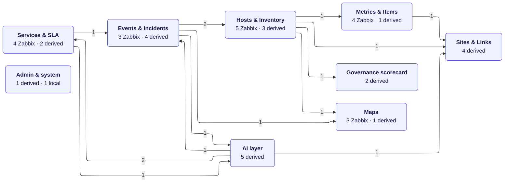
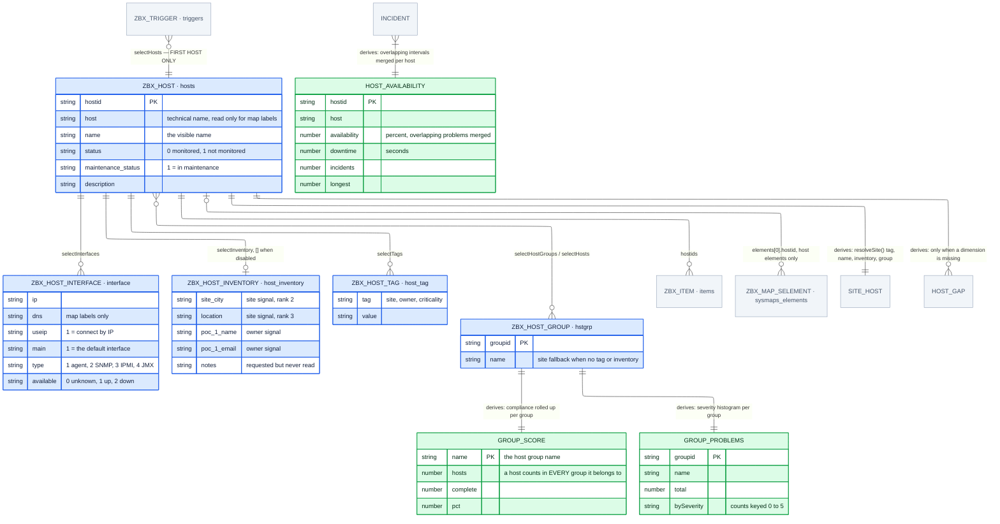
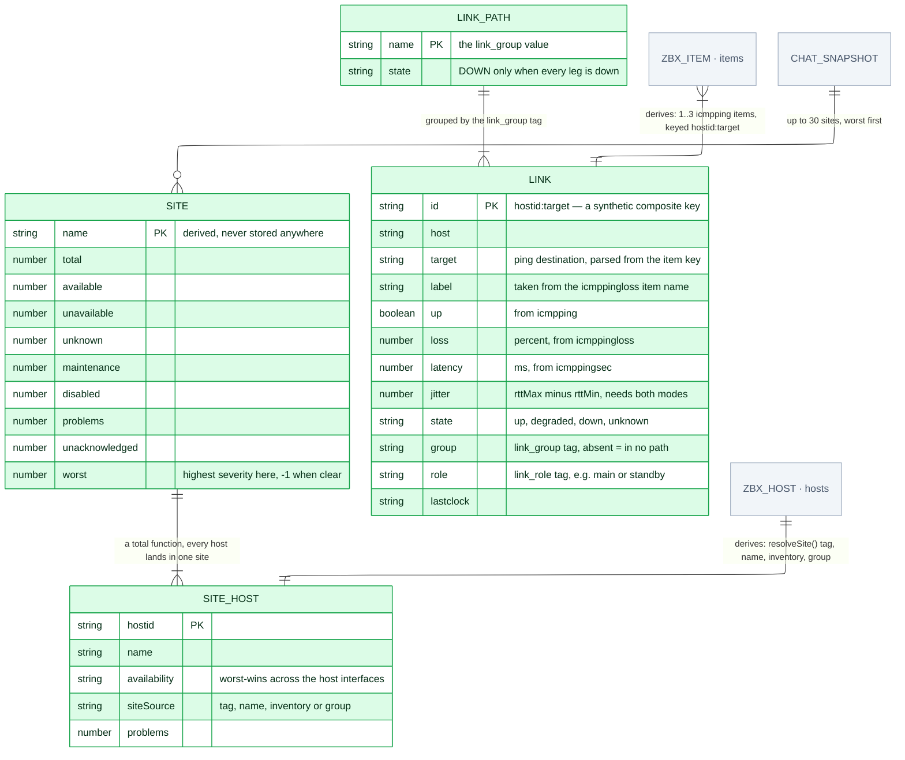
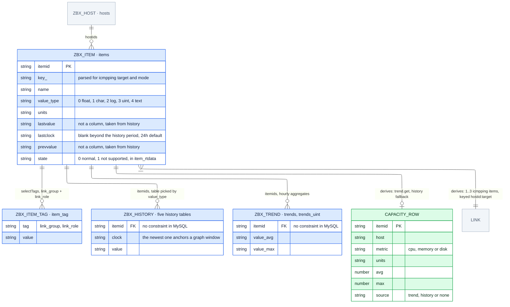
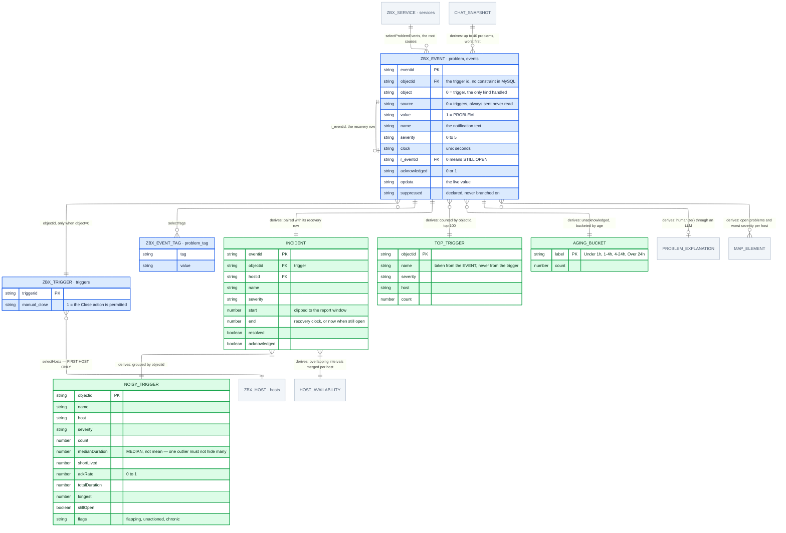
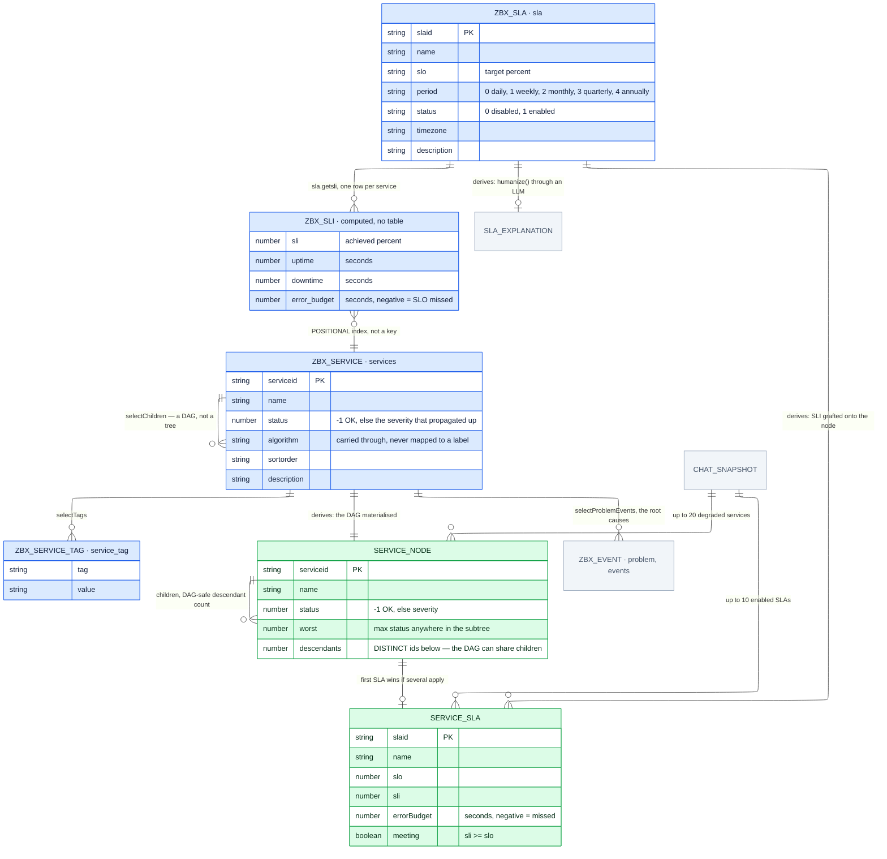
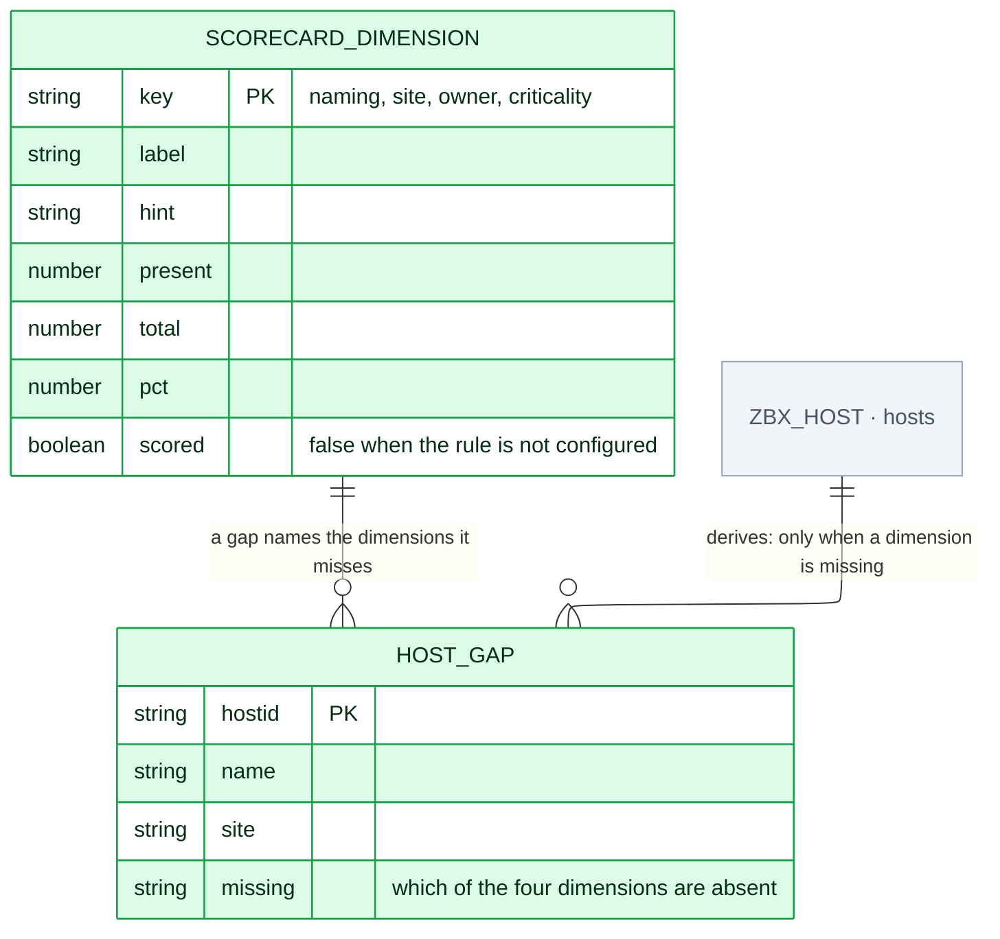
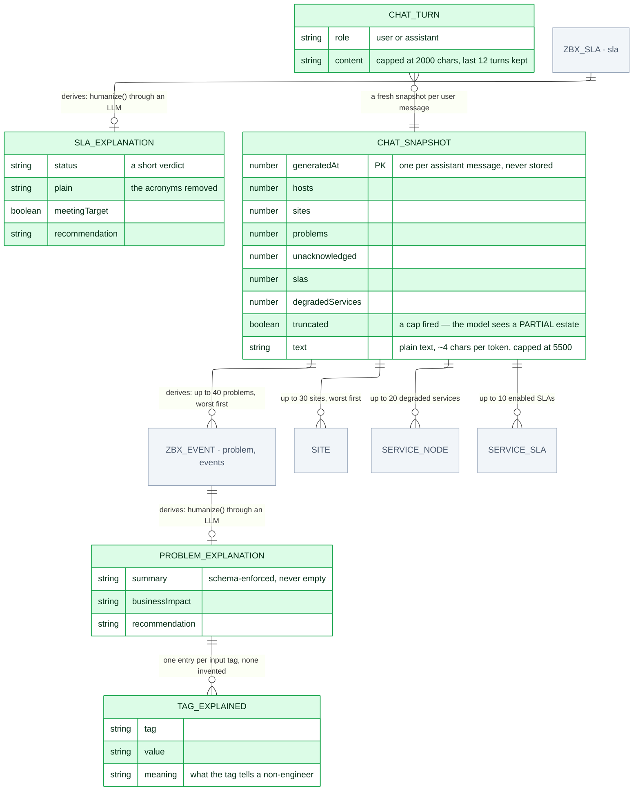
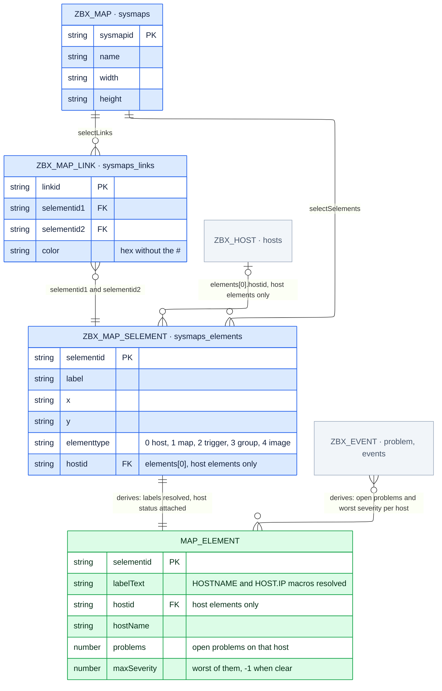
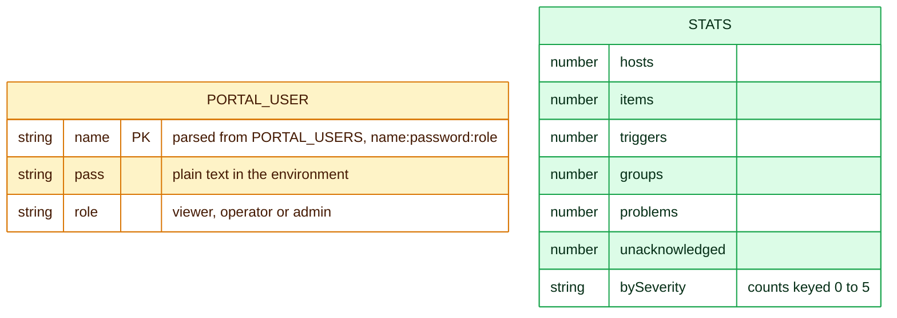

# ERD by domain: HCML Monitoring Portal

The same schema as [`ERD-Mermaid.mmd`](ERD-Mermaid.mmd), split for readability. 43 entities and 49 relationships are a lot to take in at once, so this document shows the domain map first, then each domain on its own with full attributes.

Nothing here differs from the single-diagram version (same entities, same attributes, same relationships, same names and PK/FK markers. Only the layout differs. One level up, the conceptual model) what the business talks about, with no keys or types is [`ERD-Conceptual.md`](../conceptual/ERD-Conceptual.md); the index of all three levels is in [`erd.md`](../../../erd.md#the-three-levels).

**Colour marks the layer:** blue `ZBX_*` is read from Zabbix over JSON-RPC · green is derived by the portal, which Zabbix has no equivalent for · amber is local to the portal · grey is an entity belonging to another domain, shown without attributes so the edge has somewhere to land.

**A blue entity's header names the MySQL table it is stored in**, after the dot: `ZBX_HOST · hosts`. Those tables, with their real columns and foreign keys, are diagrammed in [`ERD-Database.md`](../database/ERD-Database.md), and [`ERD-DatabaseSchema.md`](../database-schema/ERD-DatabaseSchema.md) maps every entity to its tables.

---

## Domain map

Nine domains and the relationships that cross between them. Each is a link to its section.

| Domain | Entities | Internal | Crossing |
|---|---:|---:|---:|
| [Hosts & Inventory](#hosts--inventory) | 8 | 6 | 6 |
| [Sites & Links](#sites--links) | 4 | 2 | 3 |
| [Metrics & Items](#metrics--items) | 5 | 4 | 2 |
| [Events & Incidents](#events--incidents) | 7 | 7 | 6 |
| [Services & SLA](#services--sla) | 6 | 8 | 4 |
| [Governance scorecard](#governance-scorecard) | 2 | 1 | 1 |
| [AI layer](#ai-layer) | 5 | 2 | 6 |
| [Maps](#maps) | 4 | 4 | 2 |
| [Admin & system](#admin--system) | 2 | 0 | 0 |

---

## Hosts & Inventory

The estate as Zabbix stores it, plus the per-host and per-group roll-ups the portal computes on top.

*Grey, no attributes:* `HOST_GAP`, `INCIDENT`, `SITE_HOST`, `ZBX_ITEM`, `ZBX_MAP_SELEMENT`, `ZBX_TRIGGER`. Detailed in [Governance scorecard](#governance-scorecard), [Events & Incidents](#events--incidents), [Sites & Links](#sites--links), [Metrics & Items](#metrics--items), [Maps](#maps), [Events & Incidents](#events--incidents).

---

## Sites & Links

Zabbix has no site object. `SITE` is derived from a host tag, falling back to inventory, then host group. A `LINK` is one (host, ping target) pair stitched from up to three ICMP items.

*Grey, no attributes:* `CHAT_SNAPSHOT`, `ZBX_HOST`, `ZBX_ITEM`. Detailed in [AI layer](#ai-layer), [Hosts & Inventory](#hosts--inventory), [Metrics & Items](#metrics--items).

---

## Metrics & Items

Items and their stored values: raw history in five MySQL tables and hourly trends in two, the table picked by the item's `value_type`. `lastvalue` and `lastclock` are not stored anywhere, Zabbix reads them back from history, so they go blank once the newest value is older than the history display period. `CAPACITY_ROW` aggregates a trend window, falling back to raw history on a young instance.

*Grey, no attributes:* `LINK`, `ZBX_HOST`. Detailed in [Sites & Links](#sites--links), [Hosts & Inventory](#hosts--inventory).

---

## Events & Incidents

Zabbix stores a problem and its recovery as two separate rows. `INCIDENT` pairs them, and everything downstream, availability, noise, aging, is arithmetic over those pairs. In MySQL the pairing is a table of its own, `event_recovery`, and a problem that is still live also has a row in `problem`.

*Grey, no attributes:* `CHAT_SNAPSHOT`, `HOST_AVAILABILITY`, `MAP_ELEMENT`, `PROBLEM_EXPLANATION`, `ZBX_HOST`, `ZBX_SERVICE`. Detailed in [AI layer](#ai-layer), [Hosts & Inventory](#hosts--inventory), [Maps](#maps), [AI layer](#ai-layer), [Hosts & Inventory](#hosts--inventory), [Services & SLA](#services--sla).

---

## Services & SLA

Services form a **DAG, not a tree**: one service can have several parents, so any walk must deduplicate by `serviceid`. The SLA-to-SLI join is positional, not keyed. No table stores an SLI: `sla.getsli` computes it from each service's status history in `service_alarms`.

*Grey, no attributes:* `CHAT_SNAPSHOT`, `SLA_EXPLANATION`, `ZBX_EVENT`. Detailed in [AI layer](#ai-layer), [AI layer](#ai-layer), [Events & Incidents](#events--incidents).

---

## Governance scorecard

Zabbix stores naming, site, owner and criticality but never scores them. Four dimensions, with a gap row per host that misses any.

*Grey, no attributes:* `ZBX_HOST`. Detailed in [Hosts & Inventory](#hosts--inventory).

---

## AI layer

The plain-language layer. Output shape is enforced by a JSON Schema, so the caller parses without a validation dependency.

*Grey, no attributes:* `SERVICE_NODE`, `SERVICE_SLA`, `SITE`, `ZBX_EVENT`, `ZBX_SLA`. Detailed in [Services & SLA](#services--sla), [Services & SLA](#services--sla), [Sites & Links](#sites--links), [Events & Incidents](#events--incidents), [Services & SLA](#services--sla).

---

## Maps

Maps with their elements and links. A host element is followed to its host: the BFF resolves label macros such as `{HOSTNAME} ({HOST.IP})` and attaches the host's open problems, which gives `MAP_ELEMENT`. No foreign key backs that step, `sysmaps_elements.elementid` holds a host, map or host-group id depending on `elementtype`, so MySQL cannot enforce it.

*Grey, no attributes:* `ZBX_EVENT`, `ZBX_HOST`. Detailed in [Events & Incidents](#events--incidents), [Hosts & Inventory](#hosts--inventory).

---

## Admin & system

Neither read from Zabbix nor derived from it. Portal authentication is entirely local: Zabbix users are never read, although every Zabbix call the portal makes runs as the user that owns its API token; see [API token & permissions](../database/ERD-Database.md#api-token--permissions).

---
